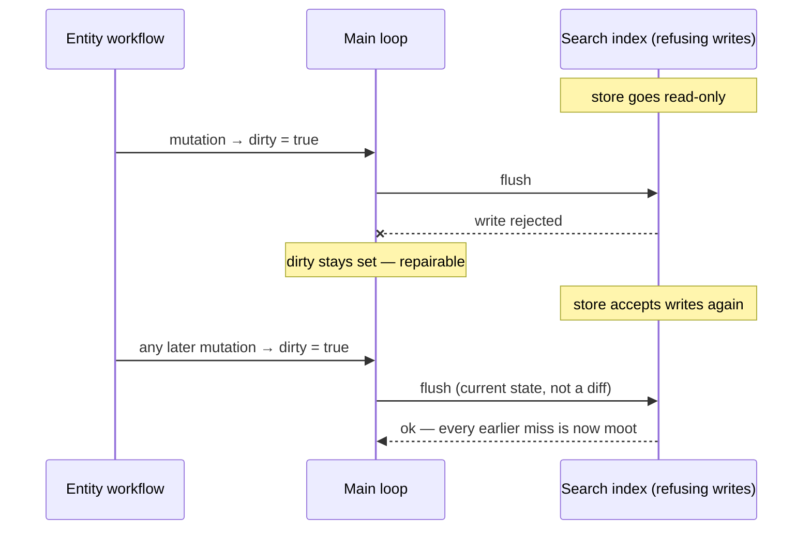
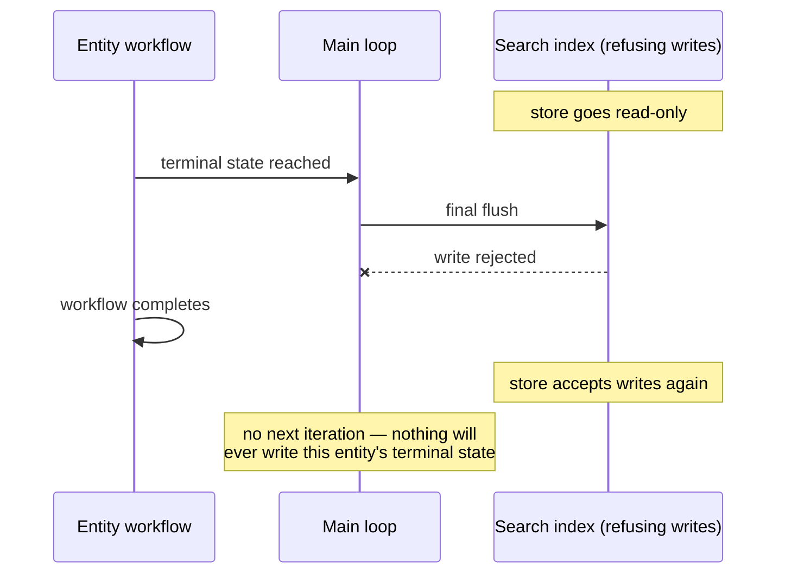

# When the Projection Store Refuses Writes

> A search index that stops accepting writes but keeps answering reads looks healthy to
> every liveness check. Live entity workflows repair their own projections on the next
> flush; an entity that reached its terminal state during the outage never does.

## The Trap

Projections are derived data: the workflow holds the authoritative state and the index
holds a copy for lists and search. That is what makes a projection *repairable* — the
[Dirty-Flag Projection](../patterns/dirty-flag-projection/) rules say a failed flush leaves
`dirty` set and the next loop iteration tries again.

The word doing the work is **next**. A workflow that is still running has a next iteration.
A workflow that has completed does not, and its final flush is the only chance its terminal
state ever gets.

So a projection-store outage splits entities into two groups, and only one of them heals:

And the group that does not:

The index keeps serving the entity's last successfully written state, which now says
something that is no longer true — `active` for a cart that is closed.

## Symptoms

| What you see | What it actually means |
|---|---|
| Cluster health green, counts answer, health checks pass | Reads are unaffected; a write block does not degrade reads |
| An entity's list row disagrees with the entity's own page | The page reads the workflow; the row reads the index |
| A dead-letter index that records nothing | The dead-letter write targets the same store, so it is blocked too |
| Dashboard panels blank rather than alarming | `rate()` over a counter created at process start sees no growth until it increments twice |
| The log is the only place the failures exist | Which is why an error-log sweep belongs in every verification pass |

The specific mechanism worth knowing: a search cluster that crosses a **disk flood-stage
watermark** marks every index read-only automatically, and clears the mark on its own once
usage falls back under the threshold. Nothing crashes. Nothing is unreachable. Writes simply
stop being accepted, for as long as the disk stays full.

## Why It Happens

Three assumptions stack up, and each is reasonable on its own.

1. **Health checks ask whether the store answers,** not whether it accepts writes. A read
   probe cannot see a write block.
2. **The failure surface lives in the failing store.** Dead letters, error documents and
   projection-lag metrics are usually written to the same cluster they describe.
3. **"The projection is repairable" is read as unconditional.** It is conditional on the
   entity workflow outliving the outage.

## Prevention

- **Probe writes, not liveness.** A health check should ask the cluster whether its indices
  carry a write block, and report the disk headroom that will cause one. Warn at the *high*
  watermark, not at flood stage — by flood stage you are already dropping writes.
- **Give the failure surface somewhere else to go.** When the dead-letter write fails, log
  the dead letter with the same fields you would have indexed. The log is the fallback of
  last resort and it must not depend on the store that is down.
- **Back off rather than hammer.** A flush that always fails pins `dirty` true; sleep in the
  catch so the workflow idles instead of spinning (Dirty-Flag Projection, gotcha 3).
- **Treat the terminal flush as a distinguished write.** It is the one flush with no retry
  after it. Anything that improves its odds — a longer activity retry policy on the terminal
  flush specifically, or a non-cancellable final flush — is worth more than the same effort
  spent on ordinary flushes.

## Fix, After the Fact

Recovery has two halves, and knowing which entity is in which half is most of the work.

1. **Live workflows repair themselves.** No action needed beyond restoring the store. Because
   the flush writes *current state* rather than an incremental delta, a single later flush
   erases an arbitrary number of missed ones. This is the property that makes the whole
   arrangement survivable, and it comes from projecting state rather than events.
2. **Closed workflows need a rebuild from the write store**, and only for entity types that
   have one. Where the workflow *is* the only source of truth, the repair window is the
   history retention period; after that the terminal state is gone and the stale document can
   only be deleted, not corrected.

Take the inventory before repairing: group the failed writes by target index and by whether
each entity's workflow is still open. In one real outage of about eleven and a half hours,
127 dropped writes reduced to a single genuinely lost document — the rest were either
re-pushes of unchanged data at worker start, entities that flushed again later, or entity
types rebuildable from the write store.

## See Also

- [Dirty-Flag Projection](../patterns/dirty-flag-projection/) — the flush loop, and why the
  flag survives a failed write
- [Workflow-Mediated Projections](../patterns/workflow-mediated-projections/) — projections as
  derived data, and rebuilds as fan-out
- [Elasticsearch — disk-based shard allocation and the flood-stage watermark](https://www.elastic.co/docs/reference/elasticsearch/configuration-reference/cluster-level-shard-allocation-routing-settings)
- [Temporal — Activity retry policies](https://docs.temporal.io/encyclopedia/retry-policies)
- [Temporal — Workflow execution retention](https://docs.temporal.io/temporal-service/temporal-server#retention-period)
