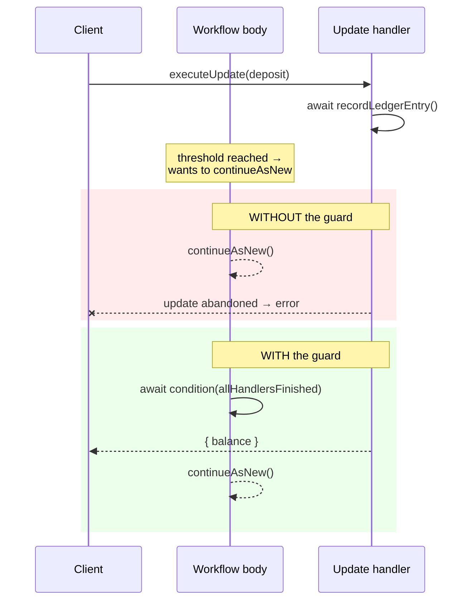

# `allHandlersFinished`

> Always `await condition(allHandlersFinished)` before any workflow exit point —
> `continueAsNew`, `return`, or `throw` — to ensure every in-flight update handler
> delivers its response.

## Problem

Update and signal handlers are `async`. A handler that awaits an activity (or a
`condition`) yields back to the workflow's main body, and the main body may decide to
exit — return, `continueAsNew`, fail — while the handler is still mid-flight. When the
workflow run closes, every unfinished handler is **abandoned**: the update caller's
`executeUpdate` rejects with an error instead of a result, and a signal handler's
remaining side effects simply never happen.

The SDK's default `unfinishedPolicy` is `WARN_AND_ABANDON`, so you get a worker log line
— but the *caller* still gets a failure. The symptom in production is an intermittent
"update failed" that clusters around `continueAsNew` boundaries and never reproduces in
a unit test, because tests rarely send an update in the same instant the workflow rolls
over.

## Solution

Treat every exit point as a barrier:

```typescript fragment
await condition(allHandlersFinished);
```

- **Before `return`** from the workflow function.
- **Before `continueAsNew`** — this is the common one, because long-lived entities roll
  over while traffic is flowing.
- **Before a deliberate failure** (`throw ApplicationFailure…`) — a failing workflow also
  abandons handlers; if a pending update deserves a real answer, let it finish first.



Two refinements:

1. **Wake on queued input too.** If the main loop itself is what a handler is waiting for
   (the handler enqueues work and waits for the loop to process it — the shape used by the
   [State Machine Driver](../state-machine-driver/)), then `condition(allHandlersFinished)`
   alone deadlocks: the handler is unfinished *because* the loop stopped. Wait for
   "all finished **or** something queued", and only exit when the queue is empty.

2. **Opt out explicitly, never implicitly.** For a handler whose abandonment is genuinely
   fine — a best-effort telemetry signal — say so with
   `{ unfinishedPolicy: HandlerUnfinishedPolicy.ABANDON }` on `setHandler`. That documents
   the decision and silences the warning. Everything else keeps the default and gets the
   guard.

## Example

An account workflow whose `deposit` update records a ledger entry (an activity) before
answering. It rolls over with `continueAsNew` when the server suggests it, and closes on a
signal — both exits pass through the same guard.

```typescript file=activities.ts
export interface AccountActivities {
  recordLedgerEntry(accountId: string, amount: number): Promise<void>;
}
```

```typescript file=workflows.ts
import {
  allHandlersFinished, condition, continueAsNew, defineSignal, defineUpdate,
  proxyActivities, setHandler, workflowInfo,
} from '@temporalio/workflow';
import type { AccountActivities } from './activities';

const { recordLedgerEntry } = proxyActivities<AccountActivities>({
  startToCloseTimeout: '10s',
});

export interface AccountState {
  accountId: string;
  balance: number;
}

export const depositUpdate = defineUpdate<{ balance: number }, [number]>('deposit');
export const closeSignal = defineSignal('close');

export async function accountWorkflow(state: AccountState): Promise<AccountState> {
  let closed = false;

  setHandler(
    depositUpdate,
    async (amount) => {
      await recordLedgerEntry(state.accountId, amount);   // the handler yields here
      state.balance += amount;
      return { balance: state.balance };
    },
    {
      validator: (amount) => {
        if (amount <= 0) throw new Error(`deposit must be positive, got ${amount}`);
      },
    },
  );
  setHandler(closeSignal, () => { closed = true; });

  await condition(() => closed || workflowInfo().continueAsNewSuggested);

  // One guard covers both exits: nothing leaves until every handler has replied.
  await condition(allHandlersFinished);

  if (closed) return state;
  return continueAsNew<typeof accountWorkflow>(state);
}
```

```typescript file=client.ts
import { Client } from '@temporalio/client';
import { depositUpdate } from './workflows';

const client = new Client();
const handle = client.workflow.getHandle('demo.account.acct-1');

// Without the guard, this call fails intermittently whenever the workflow happens to
// roll over while recordLedgerEntry is in flight.
const { balance } = await handle.executeUpdate(depositUpdate, { args: [25] });
console.log(`balance is now ${balance}`);
```

## Provenance

The mechanism is the SDK's: `allHandlersFinished()` and `HandlerUnfinishedPolicy` were
added to the TypeScript SDK alongside Workflow Update, and the official message-passing
guide recommends waiting for handlers before completing. This catalog turns the
recommendation into a **rule with a location**: every exit point, no exceptions, and —
in applications that use the state-machine driver — a single place in the framework
rather than a line each author must remember.

The "wake on queued input" refinement is first-party. It came from a deadlock in the
driver's first `continueAsNew` guard: an update handler queued its event and waited for
the loop; the loop, at threshold, waited for all handlers to finish; neither ever did.

## Gotchas

1. **The guard can deadlock when a handler waits on the main loop.** See refinement 1
   above and [State Machine Driver](../state-machine-driver/) gotcha 7. The fix is to wait
   on `allHandlersFinished() || hasQueuedInput()` and re-check before exiting.

2. **Handlers registered *after* the first `await` can miss early messages.** Register
   every handler synchronously at the top of the workflow function. This matters doubly
   for [`updateWithStart`](../update-with-start/), where the update arrives in the very
   first workflow task.

3. **Signal handlers count too.** A signal has no caller to disappoint, but a signal
   handler that awaits an activity and is abandoned leaves the activity's *effect* applied
   and the workflow's *state* not updated. `allHandlersFinished` covers signals as well as
   updates.

4. **`continueAsNewSuggested` is a hint, not a schedule.** It is true when the server
   thinks history is getting long. Pair it with your own threshold if you need predictable
   rollover points — see [`continueAsNew`](../continue-as-new/).

5. **A validator is not a handler.** Validators run synchronously before the update is
   accepted and cannot yield, so they never need — and are never waited on by — this guard.
   Reject early in the validator; do the work in the handler.

## References

- [Temporal TypeScript SDK — Message passing: finishing handlers before the workflow completes](https://docs.temporal.io/develop/typescript/workflows/message-passing#wait-for-message-handlers)
- [Temporal — Workflow message passing (encyclopedia)](https://docs.temporal.io/encyclopedia/workflow-message-passing)
- [State Machine Driver](../state-machine-driver/) — the framework that owns this guard
- [`continueAsNew`](../continue-as-new/) — the exit point where this matters most
- [Signals, Updates & Queries](../signals-updates-queries/) — which messages have handlers to finish
