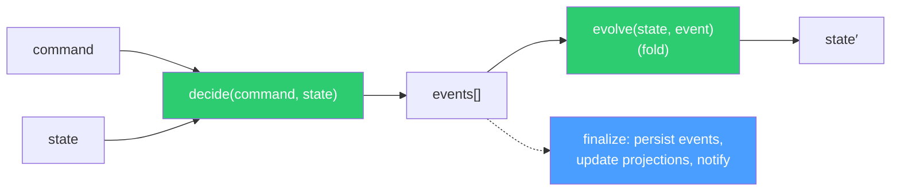

# Chassaing Decider

> Decompose business logic into `decide(command, state) → events` and
> `evolve(state, event) → state` — pure functions that are trivially testable and
> compose into event-sourced state machines.

## Problem

[Prepare → Decide → Finalize](../prepare-decide-finalize/) isolates a pure decision from
its I/O bookends. But "a pure function that returns the next state" still leaves two
questions open in any non-trivial domain:

1. **What is the unit of change?** A decision that returns a whole new context says *what*
   changed but not *why*. Projections, audit logs, and notifications all want the "why" —
   "item added", "coupon rejected: expired" — and end up diffing states to reconstruct it.

2. **How do you test a sequence?** "Given a cart with two items and an applied coupon,
   when a third item is added, then the total is recomputed" requires building that prior
   state by hand, field by field, in every test.

Temporal records an event history, but those are infrastructure events
(`ActivityTaskScheduled`, `WorkflowExecutionSignaled`). They do not say "ItemAdded".

## Solution

Model each aggregate as a **decider** — Jérémie Chassaing's functional event-sourcing
shape — and run it inside the workflow:

```typescript file=decider.ts
export interface Decider<Command, Event, State> {
  initialState: State;
  /** Pure. Given what was asked and what is true, return what happened (possibly nothing). */
  decide(command: Command, state: State): Event[];
  /** Pure and total. Fold one fact into the state. Must never throw. */
  evolve(state: State, event: Event): State;
  isTerminal(state: State): boolean;
}

/** Replay: the state is the fold of all events so far. */
export function replay<C, E, S>(d: Decider<C, E, S>, events: E[]): S {
  return events.reduce(d.evolve, d.initialState);
}
```



### Rules

1. **`decide` and `evolve` are pure.** No activities, no clock, no randomness, no throwing
   from `evolve`. Time and IDs arrive inside the command (stamped by the caller or by
   `prepare`).

2. **Rejections are events.** "Coupon rejected: expired" is a fact about the domain and
   belongs in the event stream; it is not an exception. Reserve exceptions for malformed
   input, which the update *validator* catches before anything is recorded.

3. **The state is derived from events, but kept in memory.** The workflow holds the
   current state and applies `evolve` incrementally — no need to replay the full event list
   on every command. The serialized state for `continueAsNew` is the snapshot.

4. **Events are the contract with the outside.** Projections, notifications, and audit
   logs consume events, not state diffs. Name them in the past tense, make them
   self-contained (include the data a consumer needs), and keep them
   [Record-first](../record-first-dtos/).

### How it maps onto the other patterns

| Pattern | The decider's role |
|---|---|
| [Prepare → Decide → Finalize](../prepare-decide-finalize/) | `decide` + `evolve` **are** the Decide phase; `finalize` consumes the events |
| [State Machine Driver](../state-machine-driver/) | Each state function body: `events = decide(...)`, `ctx = fold`, `next` from `isTerminal`/state |
| [Workflow-Mediated Projections](../workflow-mediated-projections/) | `finalize` ships events (or the rebuilt document) to the search index |

## Example

A cart decider with three commands, four events, and the tests that make the pattern
worth it.

```typescript file=cart-decider.ts
import type { Decider } from './decider';

export type CartCommand =
  | { type: 'AddItem'; sku: string; qty: number; unitPrice: number; at: string }
  | { type: 'ApplyCoupon'; code: string; expiresAt: string; at: string }
  | { type: 'Checkout'; at: string };

export type CartEvent =
  | { type: 'ItemAdded'; sku: string; qty: number; unitPrice: number; at: string }
  | { type: 'CouponApplied'; code: string; at: string }
  | { type: 'CommandRejected'; command: CartCommand['type']; reason: string; at: string }
  | { type: 'CheckedOut'; total: number; at: string };

export interface CartState {
  items: Record<string, { qty: number; unitPrice: number }>;
  coupon: string | null;
  checkedOut: boolean;
}

const total = (s: CartState): number =>
  Object.values(s.items).reduce((sum, { qty, unitPrice }) => sum + qty * unitPrice, 0);

export const cartDecider: Decider<CartCommand, CartEvent, CartState> = {
  initialState: { items: {}, coupon: null, checkedOut: false },

  decide(command, state) {
    if (state.checkedOut) {
      return [{ type: 'CommandRejected', command: command.type, reason: 'cart is checked out', at: command.at }];
    }
    switch (command.type) {
      case 'AddItem':
        return [{ type: 'ItemAdded', sku: command.sku, qty: command.qty, unitPrice: command.unitPrice, at: command.at }];
      case 'ApplyCoupon':
        if (command.expiresAt <= command.at) {
          return [{ type: 'CommandRejected', command: 'ApplyCoupon', reason: `coupon ${command.code} expired`, at: command.at }];
        }
        return [{ type: 'CouponApplied', code: command.code, at: command.at }];
      case 'Checkout':
        if (Object.keys(state.items).length === 0) {
          return [{ type: 'CommandRejected', command: 'Checkout', reason: 'cart is empty', at: command.at }];
        }
        return [{ type: 'CheckedOut', total: total(state), at: command.at }];
    }
  },

  evolve(state, event) {
    switch (event.type) {
      case 'ItemAdded': {
        const prev = state.items[event.sku];
        return { ...state, items: { ...state.items, [event.sku]: { qty: (prev?.qty ?? 0) + event.qty, unitPrice: event.unitPrice } } };
      }
      case 'CouponApplied': return { ...state, coupon: event.code };
      case 'CheckedOut':    return { ...state, checkedOut: true };
      case 'CommandRejected': return state;     // a fact, but not a change
    }
  },

  isTerminal: (state) => state.checkedOut,
};
```

### Testing: given / when / then

```typescript file=cart-decider.test.ts
import { replay } from './decider';
import { cartDecider } from './cart-decider';
import type { CartCommand, CartEvent } from './cart-decider';

const T = '2026-01-01T00:00:00Z';

function when(history: CartEvent[], command: CartCommand): CartEvent[] {
  return cartDecider.decide(command, replay(cartDecider, history));
}

describe('cart decider', () => {
  it('adds an item to an empty cart', () => {
    expect(when([], { type: 'AddItem', sku: 'a', qty: 1, unitPrice: 5, at: T })).toEqual([
      { type: 'ItemAdded', sku: 'a', qty: 1, unitPrice: 5, at: T },
    ]);
  });

  it('rejects checkout of an empty cart — as an event, not an exception', () => {
    expect(when([], { type: 'Checkout', at: T })).toEqual([
      { type: 'CommandRejected', command: 'Checkout', reason: 'cart is empty', at: T },
    ]);
  });

  it('checks out with the total of the folded history', () => {
    const history: CartEvent[] = [
      { type: 'ItemAdded', sku: 'a', qty: 2, unitPrice: 5, at: T },
      { type: 'ItemAdded', sku: 'b', qty: 1, unitPrice: 10, at: T },
    ];
    expect(when(history, { type: 'Checkout', at: T })).toEqual([{ type: 'CheckedOut', total: 20, at: T }]);
  });
});
```

No Temporal test environment, no mocks, no activity stubs — and the "given" is a list of
facts, not a hand-built state.

### Wiring it into a workflow

```typescript file=workflows.ts
import { condition, defineUpdate, proxyActivities, setHandler } from '@temporalio/workflow';
import { cartDecider } from './cart-decider';
import type { CartCommand, CartEvent, CartState } from './cart-decider';
import type { CartActivities } from './activities';

const { recordEvents } = proxyActivities<CartActivities>({ startToCloseTimeout: '10s' });

export const cartCommandUpdate = defineUpdate<CartState, [CartCommand]>('cart.command');

export async function cartWorkflow(): Promise<CartState> {
  let state = cartDecider.initialState;

  setHandler(cartCommandUpdate, async (command) => {
    const events = cartDecider.decide(command, state);           // decide (pure)
    state = events.reduce(cartDecider.evolve, state);           // evolve (pure)
    if (events.length > 0) await recordEvents(events);          // finalize (I/O)
    return state;
  });

  await condition(() => cartDecider.isTerminal(state));
  return state;
}
```

```typescript file=activities.ts
import type { CartEvent } from './cart-decider';
export interface CartActivities {
  recordEvents(events: CartEvent[]): Promise<void>;
}
```

## Provenance

The decider is Jérémie Chassaing's formulation of functional event sourcing (2021), which
itself descends from Greg Young's event-sourcing work and the "functional core, imperative
shell" idea. The first-party contribution is the *placement*: running the decider inside a
Temporal workflow, where the workflow holds the in-memory state (no event store required
for correctness — Temporal's history is the durability), events flow to projections via
activities, and the `continueAsNew` argument is the snapshot. The `given/when/then` helper
came from a checkout domain whose state-based tests had become unreadable.

## Gotchas

1. **`evolve` must be total and must not throw.** It is called on replay and on every
   event ever recorded. An `evolve` that throws on an event shape it no longer expects
   corrupts the aggregate. Handle unknown events by returning `state` unchanged, and
   version event schemas deliberately (gotcha 3).

2. **Keep time out of `evolve`.** The timestamp is part of the event, put there by
   `decide` from the command. An `evolve` that reads a clock produces different states on
   replay of the same events.

3. **Event schemas are contracts — version them.** A persisted `ItemAdded` from last year
   must still fold today. Add fields with defaults; for breaking changes introduce
   `ItemAddedV2` and an upcaster, never edit an event's meaning in place.

4. **Rejections as events vs. update validators.** Use the validator for *malformed*
   requests (negative quantity, missing field) — rejected before anything is recorded.
   Use `CommandRejected` events for *domain* refusals (expired coupon, empty cart) — facts
   the business wants to see. Do not route domain rules through the validator; it is
   synchronous and sees no prepared data.

5. **Don't replay the world on every command.** Classic event sourcing rebuilds state from
   the store; here the workflow already holds it. `replay()` is for tests and for cold
   starts from a persisted event log, not for the hot path.

6. **Payload size.** Events recorded via an activity are payloads; a burst of large events
   hits the same limits as any DTO — see [Record-First DTOs](../record-first-dtos/).

## References

- Jérémie Chassaing, [Functional Event Sourcing Decider](https://thinkbeforecoding.com/post/2021/12/17/functional-event-sourcing-decider) (2021)
- Gary Bernhardt, [Functional Core, Imperative Shell](https://www.destroyallsoftware.com/screencasts/catalog/functional-core-imperative-shell) (2012)
- [Prepare → Decide → Finalize](../prepare-decide-finalize/) — the workflow-level phase split the decider sits inside
- [State Machine Driver](../state-machine-driver/) — where each state function can host a decider
- [Workflow-Mediated Projections](../workflow-mediated-projections/) — where the events go
- [Record-First DTOs](../record-first-dtos/) — the shape of commands and events
