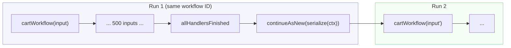

# `continueAsNew`

> Reset event history for long-running workflows (carts, services, singletons)
> without losing state — by explicitly serializing everything that matters into
> the new execution's arguments.

## Problem

A workflow's event history is append-only and bounded (by default the server warns at
10K events and terminates at 51,200 events or 50 MB). Entity workflows — a cart that lives
for weeks, an inventory service that lives forever — would hit that limit if every signal,
update, timer, and activity kept accumulating in one run.

`continueAsNew` is the SDK's answer: close the current run and atomically start a fresh
one with the **same workflow ID** and a new, empty history. The catch is the word
*fresh*: the new run begins from the workflow function's first line with nothing but the
arguments you passed. In-memory state, pending timers, and any input your own code was
holding in a queue are gone unless you carried them across on purpose.

## Solution

Treat the workflow's **input type as its serialized state**, and make rollover an
explicit, guarded transition.



### Rules

1. **`buildInitialContext(input)` and `serialize(ctx)` are inverses.** Whatever the
   workflow needs in order to resume — entity state, counters, *deadlines as absolute
   timestamps* — is a field of the input type. If it isn't in the input, it doesn't
   survive.

2. **Trigger on either signal, whichever comes first.** `workflowInfo().continueAsNewSuggested`
   is the server's hint that history is getting long; an input counter gives predictable
   rollover points that tests can hit. Use both.

3. **Guard the exit.** `await condition(allHandlersFinished)` — and drain any input queue
   your own code holds — before calling `continueAsNew`. See
   [`allHandlersFinished`](../all-handlers-finished/).

4. **Version the shape.** The new run may start on a newer build than the one that
   serialized the arguments. Give the input a `version` field and a migration step at the
   top of the workflow, so old-shaped arguments are upgraded rather than misread.

5. **Carry deadlines, not durations.** A `'30 days'` timer restarts from zero in the new
   run. Store `expiresAt` and compute the remaining duration on entry.

## Example

A cart that expires 30 days after creation, accepts item signals, and rolls over every
500 inputs or when the server suggests it.

```typescript file=workflows.ts
import {
  allHandlersFinished, condition, continueAsNew, defineQuery, defineSignal, setHandler,
  workflowInfo,
} from '@temporalio/workflow';

// The input type IS the serialized state. Record, not Map — it must survive JSON.
export interface CartInput {
  version: 1;
  tenantId: string;
  cartId: string;
  items: Record<string, number>;   // sku → quantity
  expiresAt: string;               // absolute ISO timestamp, not a duration
  updatedAt: string;
}

export const addItemSignal = defineSignal<[string, number]>('addItem');
export const checkoutSignal = defineSignal('checkout');
export const getCartQuery = defineQuery<CartInput>('getCart');

const INPUTS_PER_RUN = 500;

export async function cartWorkflow(input: CartInput): Promise<CartInput> {
  const cart: CartInput = { ...input, items: { ...input.items } };
  let inputsThisRun = 0;
  let checkedOut = false;

  setHandler(addItemSignal, (sku, qty) => {
    cart.items[sku] = (cart.items[sku] ?? 0) + qty;
    cart.updatedAt = new Date().toISOString();   // deterministic inside the sandbox
    inputsThisRun += 1;
  });
  setHandler(checkoutSignal, () => { checkedOut = true; });
  setHandler(getCartQuery, () => cart);

  // Rule 5: the deadline is absolute; each run waits only for what is left of it.
  const remainingMs = new Date(cart.expiresAt).getTime() - Date.now();
  if (remainingMs <= 0) return cart;

  const woke = await condition(
    () => checkedOut || inputsThisRun >= INPUTS_PER_RUN || workflowInfo().continueAsNewSuggested,
    remainingMs,
  );
  if (!woke) return cart;          // expired

  // Rule 3: nothing leaves until every handler has replied.
  await condition(allHandlersFinished);
  if (checkedOut) return cart;

  // Rule 1: what we pass is exactly what the next run will see.
  return continueAsNew<typeof cartWorkflow>(cart);
}
```

Reading the same workflow ID from a client is unchanged across runs — the handle follows
the chain:

```typescript file=client.ts
import { Client } from '@temporalio/client';
import { getCartQuery } from './workflows';

const client = new Client();
const cart = await client.workflow.getHandle('store-001.cart.c-42').query(getCartQuery);
console.log(Object.keys(cart.items).length, 'distinct SKUs');
```

### Migrating the shape

When `CartInput` grows a field, the run that serialized the old shape may hand it to a
build that expects the new one. Upgrade on entry:

```typescript fragment
type AnyCartInput = CartInputV1 | CartInput;   // CartInput is the current (v2) shape

function migrate(input: AnyCartInput): CartInput {
  switch (input.version) {
    case 1:  return { ...input, version: 2, couponCodes: [] };
    case 2:  return input;
  }
}

export async function cartWorkflow(raw: AnyCartInput): Promise<CartInput> {
  const cart = migrate(raw);
  // ...
}
```

## Provenance

`continueAsNew` and `continueAsNewSuggested` are SDK primitives, and the official
Entity-Lifecycle patterns describe when to use them. What this page adds is first-party:

- The "input type is the serialized state" discipline came from a cart workflow whose
  first rollover silently dropped a reservation map that lived only in a local variable.
- The "deadlines, not durations" rule came from a cart whose 30-day expiry restarted on
  every rollover and effectively never expired.
- The guard ordering (finish handlers → drain → continue) is the same lesson recorded in
  [`allHandlersFinished`](../all-handlers-finished/) and factored into the
  [State Machine Driver](../state-machine-driver/), which counts every input toward the
  threshold and performs the rollover itself.

## Gotchas

1. **`continueAsNew` never returns — and it *throws*.** It resolves to `never`; under the
   hood the SDK throws a `ContinueAsNew` signal error that it catches itself. A broad
   `try { … } catch (err) { log(err) }` around it swallows that and the workflow just
   continues on in the old run. If you must wrap it, re-throw `ContinueAsNew`:

   ```typescript fragment
   } catch (err) {
     if (err instanceof ContinueAsNew) throw err;
     // handle real errors
   }
   ```

2. **Children with the default `ParentClosePolicy` are terminated.** Closing the old run
   *is* the parent closing. A long-running child started from an entity workflow must use
   `ParentClosePolicy.ABANDON` or it dies on the first rollover — see
   [Parent-Child with ABANDON](../parent-child-abandon/).

3. **Queued inputs your code holds are lost.** The server re-delivers signals that it
   buffered, but anything sitting in an in-memory array of your own is gone. Drain your
   queue before continuing; the driver does this explicitly.

4. **Timers restart.** Rule 5 — carry `expiresAt`, not `'30 days'`.

5. **Search attributes and memo carry over by default; arguments do not.** If you rely on
   `typedSearchAttributes` set at start, they follow the chain. If you rely on a workflow
   *argument* the client passed only once, it must be in the serialized state.

6. **Don't rely on counting alone, or on the hint alone.** Counting misses big payloads
   (a few large signals can exceed the size limit before 500 inputs); the hint arrives late
   and is not deterministic across worker versions. Use both, as in the example.

## References

- [Temporal — Continue-As-New](https://docs.temporal.io/workflow-execution/continue-as-new)
- [Temporal Design Patterns — Entity & Lifecycle: Continue-As-New](https://docs.temporal.io/design-patterns/entity-lifecycle-patterns) — the official pattern; this page is the TypeScript-specific discipline around it
- [`allHandlersFinished`](../all-handlers-finished/) — the guard before the exit
- [State Machine Driver](../state-machine-driver/) — owns the threshold, the guard, and the drain
- [Record-First DTOs](../record-first-dtos/) — why the serialized state uses `Record`, not `Map`
- [Parent-Child with ABANDON](../parent-child-abandon/) — keeping children alive across rollover
