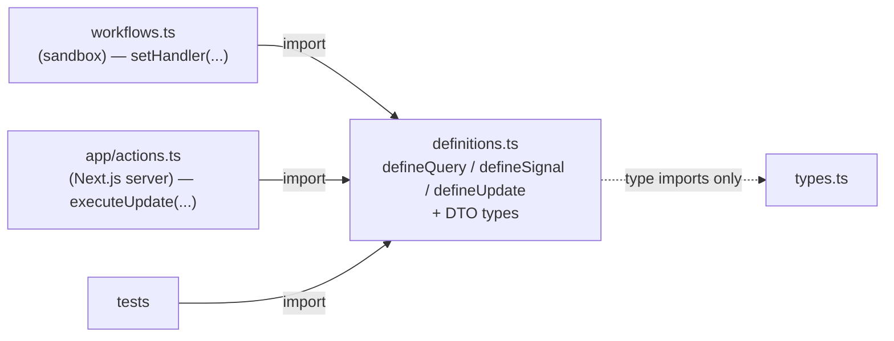

# Definitions File Pattern

> Centralize all `defineQuery`, `defineSignal`, and `defineUpdate` declarations in a
> single `definitions.ts` file per domain, creating a safe import target for both
> workflow code and web app server code.

## Problem

A query, signal, or update is identified by a **name string** and typed by **generic
parameters** — and both sides of the conversation must agree on both. `defineUpdate<CartView,
[AddItemCommand]>('addItem')` has to be the same object in the workflow that calls
`setHandler` and in the web app that calls `executeUpdate`. Where does it live?

- **In `workflows.ts`** — the official samples do this. It works, but then every consumer
  of the definition imports the workflow module, and with it the entire workflow module
  graph: activity proxies, state tables, helpers. A Next.js server action that only wants
  `addItemUpdate` now has the workflow code in its bundle graph, and the web bundler's
  opinions about that code (tree-shaking, module resolution, `require.resolve`) become
  your problem.
- **In the client code** — then the workflow must import client code to register the
  handler, dragging `@temporalio/client` and its gRPC stack toward the sandbox bundle.
- **Declared twice** — `'addItem'` typed independently on each side. Rename one and the
  other silently sends messages no handler is listening for.

## Solution

One `definitions.ts` per domain that contains **only** `define*` calls and the DTO types
they reference. It imports nothing but `@temporalio/workflow` (for the `define*`
functions, which are pure — they build `{ type, name }` descriptors and touch no runtime
state) and type-only imports.



### Rules

1. **`definitions.ts` imports only `define*` from `@temporalio/workflow`, plus `import type`.**
   No activities, no proxies, no workflow functions, no client. The file must be loadable by
   the workflow isolate, by Node, and by the web bundler without side effects.

2. **Every `define*` call in the domain lives here.** `workflows.ts` imports definitions
   to register handlers; client code imports them to send messages. Nobody else calls
   `defineUpdate`. Enforce it with lint (below).

3. **Names are namespaced by domain.** `'cart.addItem'`, not `'addItem'`. Names appear in
   the UI and CLI; a prefix makes `temporal workflow describe` output self-explanatory and
   keeps two domains from accidentally sharing a name.

4. **DTOs are plain, serializable data** — [Record-First DTOs](../record-first-dtos/).
   They may live in the same file or a sibling `types.ts`; either way they are pure types.

### Enforcement

```javascript
// eslint.config.js — define* calls belong in definitions.ts
{
  files: ['src/**/*.ts'],
  ignores: ['src/**/definitions.ts'],
  rules: {
    'no-restricted-syntax': ['error', {
      selector: 'CallExpression[callee.name=/^define(Query|Signal|Update)$/]',
      message: 'Declare queries/signals/updates in the domain definitions.ts, not here.',
    }],
  },
}
```

## Example

```typescript file=definitions.ts
import { defineQuery, defineSignal, defineUpdate } from '@temporalio/workflow';
import type { AddItemCommand, CartView } from './types';

export const getCartQuery  = defineQuery<CartView>('cart.get');
export const addItemUpdate = defineUpdate<CartView, [AddItemCommand]>('cart.addItem');
export const abandonSignal = defineSignal<[string]>('cart.abandon');
```

```typescript file=types.ts
export interface CartView {
  items: Record<string, number>;   // sku → quantity
  total: number;
}
export interface AddItemCommand {
  sku: string;
  qty: number;
  unitPrice: number;
}
```

The workflow registers handlers against the shared definitions:

```typescript file=workflows.ts
import { condition, setHandler } from '@temporalio/workflow';
import { abandonSignal, addItemUpdate, getCartQuery } from './definitions';
import type { CartView } from './types';

export async function cartWorkflow(): Promise<CartView> {
  const cart: CartView = { items: {}, total: 0 };
  let abandoned = false;

  setHandler(getCartQuery, () => cart);
  setHandler(addItemUpdate, ({ sku, qty, unitPrice }) => {
    cart.items[sku] = (cart.items[sku] ?? 0) + qty;
    cart.total += qty * unitPrice;
    return cart;
  });
  setHandler(abandonSignal, () => { abandoned = true; });

  await condition(() => abandoned);
  return cart;
}
```

And a Next.js server action imports the *same* objects — no workflow code in its graph:

```typescript file=actions.ts
'use server';
import { Client } from '@temporalio/client';
import { addItemUpdate, getCartQuery } from './definitions';
import type { AddItemCommand, CartView } from './types';

const client = new Client();

export async function addItem(workflowId: string, command: AddItemCommand): Promise<CartView> {
  return client.workflow.getHandle(workflowId).executeUpdate(addItemUpdate, { args: [command] });
}

export async function getCart(workflowId: string): Promise<CartView> {
  return client.workflow.getHandle(workflowId).query(getCartQuery);
}
```

Rename the update in one place and both sides fail to compile until they agree again.

## Provenance

The SDK's `define*` functions exist precisely so that a definition can be shared; the
official samples share them by exporting from `workflows.ts`. The dedicated file is a
first-party convention that fell out of the
[Two-File Activity](../two-file-activity/) split: once activities had a sandbox-safe
contract file, the message definitions needed the same thing for the **third consumer** —
the web framework's bundler — and `workflows.ts` was the wrong home for the same reason
`activities-impl.ts` was. The domain-prefixed naming came later, from reading
`temporal workflow describe` output across six domains that all had an update named
`submit`.

## Gotchas

1. **This is a value import, not a type import.** Unlike the activity contract, the web
   app needs the definition objects at runtime. That is *why* the file must be clean: a
   single stray import of an activity implementation turns every server action into a
   worker.

2. **Don't re-export definitions from `workflows.ts` "for convenience".** It recreates the
   problem: consumers import the convenient path and get the whole graph. Keep one import
   path.

3. **Renaming the name string is a wire-protocol change.** In-flight workflows on older
   code listen for the old name; clients on new code send the new one. Add the new
   definition, register handlers for both during the transition, retire the old one when
   no execution that knows it remains.

4. **`proxyActivities` does not belong here.** Activity proxies are workflow-side and live
   in `activities.ts` — see [Two-File Activity](../two-file-activity/). A definitions file
   that also proxies activities is halfway back to the single-file problem.

5. **Type parameters are the contract; the name is the address.** `defineUpdate<Ret,
   Args>` is what makes `setHandler` and `executeUpdate` agree on shapes. Declaring
   `defineUpdate('cart.addItem')` without type parameters compiles and gives you `any` on
   both ends.

## References

- [Temporal TypeScript SDK — Message passing](https://docs.temporal.io/develop/typescript/workflows/message-passing)
- [Two-File Activity](../two-file-activity/) — the companion split for activities
- [Record-First DTOs](../record-first-dtos/) — what the DTO types may contain
- [Signals, Updates & Queries](../signals-updates-queries/) — choosing which to define
