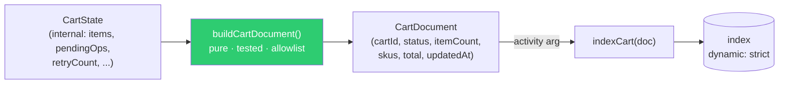

# Document Builder

> Explicitly map fields from workflow state to search index documents using a
> dedicated builder function — never spread internal state directly into an
> Elasticsearch document.

## Problem

The shortest way to project a workflow's state is `es.index({ document: { ...state } })`.
It works on day one and fails in four slow-motion ways:

1. **Internal fields leak.** Pending commands, retry counters, correlation scaffolding,
   anything the workflow keeps for itself — all indexed, all searchable, some of it
   sensitive.
2. **Mapping drift breaks writes.** Add a field to the state, and the index's dynamic
   mapping guesses its type. Change the field's shape later (a string becomes an object)
   and every write fails with a mapping conflict — the projection is now permanently
   stale, and the workflow keeps retrying an activity that can never succeed.
3. **Derived fields have no home.** `itemCount`, `total`, `facets` — the things the search
   UI actually filters on — either get computed in the activity (untestable without the
   index) or stored in workflow state (now two sources of truth).
4. **Serialization surprises.** A `Map` or `Date` in state arrives at the index as `{}` or
   a string — see [Record-First DTOs](../record-first-dtos/).

## Solution

A **document type** that mirrors the index mapping, and a **pure builder** that is the
only way to produce one:

- `CartDocument` is an `interface` with exactly the indexed fields — an allowlist.
- `buildCartDocument(state): CartDocument` is a pure function: no I/O, no clock. It
  selects, renames, and derives. It is unit-tested like any pure function.
- The index mapping is **strict** (`dynamic: 'strict'`), so a document with a field the
  mapping does not know is rejected loudly in development, not guessed at in production.
- The builder lives **workflow-side** (it is called in `finalize`), so the document is the
  activity's *input* — visible in history, testable without the index.



### Rules

1. **The document interface is the allowlist.** Nothing reaches the index that is not
   named there. Adding a state field changes nothing until someone maps it on purpose.

2. **The builder is pure and workflow-side.** Given the same state it returns the same
   document; it may be called in a workflow, a test, or a rebuild script without an index
   handy.

3. **Derive in the builder, store in the state only what is primary.** `total` is
   computed from items every time; it is never a field a handler has to remember to update.

4. **Mapping is strict and versioned.** `dynamic: 'strict'` in the mapping; a breaking
   shape change is a new index behind the same alias (see
   [Workflow-Mediated Projections](../workflow-mediated-projections/), gotcha 3).

5. **Documents are Record-first DTOs.** Strings for dates, arrays for sets, `Record` for
   maps — and `assertSerializable<CartDocument>()`.

## Example

```typescript file=state.ts
/** Internal workflow state — has things the index must never see. */
export interface CartState {
  tenantId: string;
  cartId: string;
  status: 'open' | 'checked_out' | 'abandoned';
  items: Record<string, { qty: number; unitPriceCents: number }>;
  couponCodes: string[];
  createdAt: string;
  updatedAt: string;
  // internal scaffolding:
  pendingReservationIds: string[];
  projectionRetryCount: number;
}
```

```typescript file=document.ts
import type { CartState } from './state';

/** Exactly the fields the search UI needs — nothing else. Mirrors the index mapping. */
export interface CartDocument {
  tenantId: string;
  cartId: string;
  status: CartState['status'];
  itemCount: number;
  distinctSkus: string[];
  totalCents: number;
  hasCoupon: boolean;
  createdAt: string;
  updatedAt: string;
}

export function buildCartDocument(state: CartState): CartDocument {
  const lines = Object.entries(state.items);
  return {
    tenantId: state.tenantId,
    cartId: state.cartId,
    status: state.status,
    itemCount: lines.reduce((n, [, l]) => n + l.qty, 0),
    distinctSkus: lines.map(([sku]) => sku).sort(),
    totalCents: lines.reduce((n, [, l]) => n + l.qty * l.unitPriceCents, 0),
    hasCoupon: state.couponCodes.length > 0,
    createdAt: state.createdAt,
    updatedAt: state.updatedAt,
  };
}
```

```typescript file=document.test.ts
import { buildCartDocument } from './document';
import type { CartState } from './state';

const base: CartState = {
  tenantId: 't1', cartId: 'c1', status: 'open',
  items: { 'sku-a': { qty: 2, unitPriceCents: 500 }, 'sku-b': { qty: 1, unitPriceCents: 1000 } },
  couponCodes: [], createdAt: '2026-01-01T00:00:00Z', updatedAt: '2026-01-02T00:00:00Z',
  pendingReservationIds: ['r-9'], projectionRetryCount: 3,
};

it('derives counts and totals, and omits internal fields', () => {
  const doc = buildCartDocument(base);
  expect(doc).toEqual({
    tenantId: 't1', cartId: 'c1', status: 'open',
    itemCount: 3, distinctSkus: ['sku-a', 'sku-b'], totalCents: 2000, hasCoupon: false,
    createdAt: '2026-01-01T00:00:00Z', updatedAt: '2026-01-02T00:00:00Z',
  });
  expect('pendingReservationIds' in doc).toBe(false);
});
```

The strict mapping that the document type mirrors:

```json
{
  "mappings": {
    "dynamic": "strict",
    "properties": {
      "tenantId":     { "type": "keyword" },
      "cartId":       { "type": "keyword" },
      "status":       { "type": "keyword" },
      "itemCount":    { "type": "integer" },
      "distinctSkus": { "type": "keyword" },
      "totalCents":   { "type": "long" },
      "hasCoupon":    { "type": "boolean" },
      "createdAt":    { "type": "date" },
      "updatedAt":    { "type": "date" }
    }
  }
}
```

Used from the workflow's finalize step:

```typescript fragment
// finalize — the builder runs workflow-side; the activity receives the finished document
await indexCart(buildCartDocument(state));
```

## Provenance

Explicit read-model mapping is standard CQRS practice. The first-party lessons are the
two failure modes that motivated making it a *named* pattern with a test: an index that
accepted `{ ...ctx }` for months and then rejected every write after a state field changed
from string to object (the projection was stale for a day before anyone noticed, because
the workflows were healthy), and a `pendingReservationIds` field that turned up in a
customer-facing search facet. Strict mappings and a builder-per-document closed both.

## Gotchas

1. **`dynamic: 'strict'` is the other half.** Without it, the builder is a convention;
   with it, an unmapped field is a hard error in the first test that writes a document.

2. **Don't build in the activity.** An activity that takes `CartState` and maps it inside
   hides the mapping from history (the payload is the whole state), needs the index to
   test, and tempts the next person to "just add one field" there. The activity takes a
   `CartDocument`.

3. **Keep the builder total.** It runs for every state the workflow can be in. A builder
   that throws on an unexpected status is a projection outage.

4. **Derived fields change when the formula changes.** Changing how `totalCents` is
   computed means documents written before the change disagree with ones written after.
   Reproject (signal every workflow) after changing a derivation.

5. **Two documents from one state is fine.** A cart may feed a `carts` index and a
   per-tenant `activity-feed` index; that is two builders, two document types, two
   activities — not one builder with a mode flag.

6. **PII.** The builder is where "this field must never be searchable" is enforced. Code
   review of `document.ts` is a privacy review.

## References

- [Workflow-Mediated Projections](../workflow-mediated-projections/) — the only code that calls the activity
- [Dirty-Flag Projection](../dirty-flag-projection/) — when the document is built
- [Record-First DTOs](../record-first-dtos/) — what the document may contain
- [Prepare → Decide → Finalize](../prepare-decide-finalize/) — the phase the builder runs in
