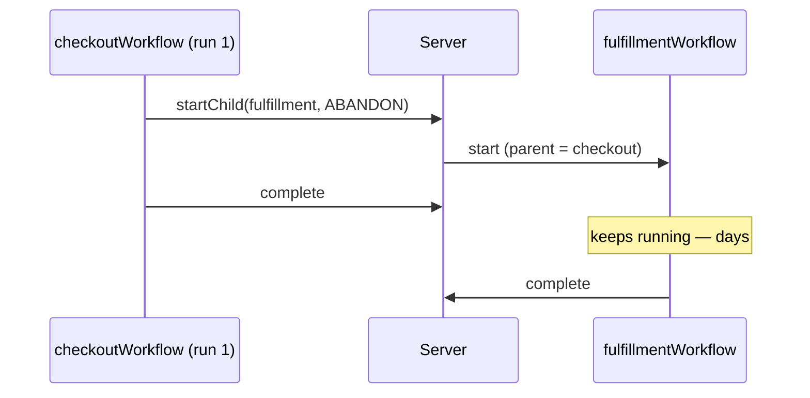

# Parent-Child with ABANDON

> Use `startChild` with `parentClosePolicy: 'ABANDON'` when a child workflow must
> survive the parent's completion or `continueAsNew`, while keeping the parent link
> for observability.

## Problem

A checkout workflow starts a fulfillment workflow. Checkout completes in minutes;
fulfillment runs for days. With the default `ParentClosePolicy.TERMINATE`, the moment the
checkout run closes, the server terminates the fulfillment child — and "the parent run
closes" includes **`continueAsNew`**: an entity workflow that rolls over every 500 inputs
kills every child it ever started, on schedule.

The usual workarounds each give something up:

- **`executeChild` and wait** — the parent cannot complete until the child does; a
  checkout that stays open for a week of fulfillment is wrong, and it blocks the parent's
  own `continueAsNew`.
- **Start a top-level workflow from an activity** — an activity with a client calls
  `client.workflow.start(...)`. The parent/child link in the UI is gone, the start is
  at-least-once (activity retries), and you have turned a single workflow command into an
  activity round trip.

## Solution

Start the child with `ParentClosePolicy.ABANDON`: the child keeps running when the parent
closes, and the parent link — visible in the UI and queryable via `ParentWorkflowId` — is
preserved.



### Choosing the policy

| Policy | Child is… | Use when |
|---|---|---|
| `TERMINATE` (default) | a sub-step of the parent | fan-out work that is meaningless without the parent |
| `REQUEST_CANCEL` | a sub-step that must clean up | the child holds resources and should see the cancel |
| `ABANDON` | an entity with its own lifecycle | hand-off between domains; parent may complete or roll over first |

### Rules

1. **ABANDON whenever the parent is an entity that can `continueAsNew`.** If the parent
   rolls over, any other policy is a time bomb.

2. **Give the child a structured, derivable workflow ID.** The parent will not be around
   to hand out the child's handle; anyone who needs it reconstructs it — see
   [Structured Workflow IDs](../structured-workflow-ids/).

3. **Correlate with search attributes at start.** `OrderId`, `CorrelationId`, `TenantId`
   on the child, so "everything for this order" is one visibility query even after the
   parent is gone.

4. **`await startChild(...)` resolves when the child has *started*.** It does not wait
   for the result. If the parent wants the result, `await handle.result()` — but then the
   parent is waiting, and the policy choice barely matters.

5. **The child is independently correct.** It has its own timeouts, its own failure
   handling, its own projection. An abandoned child that assumes "the parent will notice
   if I hang" is wrong by construction.

## Example

```typescript file=workflows.ts
import { ParentClosePolicy, startChild } from '@temporalio/workflow';
import { fulfillmentWorkflow } from './fulfillment';
import type { FulfillmentInput } from './fulfillment';
import { buildWorkflowStartOptions } from './contracts';

export interface CheckoutInput {
  tenantId: string;
  cartId: string;
  orderId: string;
  lines: Array<{ sku: string; qty: number }>;
}

export async function checkoutWorkflow(input: CheckoutInput): Promise<{ orderId: string }> {
  // ... payment, inventory reservation, order creation ...

  const fulfillmentInput: FulfillmentInput = { tenantId: input.tenantId, orderId: input.orderId, lines: input.lines };

  const child = await startChild(fulfillmentWorkflow, {
    ...buildWorkflowStartOptions({                    // Rule 2 + 3: derivable ID, correlation
      tenantId: input.tenantId,
      domain: 'fulfillment',
      entityId: input.orderId,
      orderId: input.orderId,
      correlationId: input.cartId,
    }),
    args: [fulfillmentInput],
    taskQueue: 'fulfillment-queue',
    parentClosePolicy: ParentClosePolicy.ABANDON,     // Rule 1: outlives this run
  });

  // Rule 4: `child` is a handle; the child is running. We deliberately do not await its result.
  return { orderId: input.orderId, ...{ fulfillmentWorkflowId: child.workflowId } };
}
```

```typescript file=fulfillment.ts
import { condition, defineSignal, setHandler } from '@temporalio/workflow';

export interface FulfillmentInput {
  tenantId: string;
  orderId: string;
  lines: Array<{ sku: string; qty: number }>;
}
export const shippedSignal = defineSignal<[string]>('fulfillment.shipped');

export async function fulfillmentWorkflow(input: FulfillmentInput): Promise<{ trackingNumber: string }> {
  let trackingNumber: string | null = null;
  setHandler(shippedSignal, (t) => { trackingNumber = t; });
  // Rule 5: its own deadline — it will not be rescued by the parent.
  const shipped = await condition(() => trackingNumber !== null, '14 days');
  if (!shipped) throw new Error(`order ${input.orderId} not shipped within 14 days`);
  return { trackingNumber: trackingNumber! };
}
```

Later, anyone can find the child without the parent:

```typescript file=client.ts
import { Client } from '@temporalio/client';
import { buildWorkflowId } from './contracts';

const client = new Client();
const handle = client.workflow.getHandle(buildWorkflowId('store-001', 'fulfillment', 'order-42'));
console.log((await handle.describe()).status.name);
```

## Provenance

`ParentClosePolicy` is a server concept; the official Child Workflows pattern documents
the three values. The first-party rule is the *default choice for entity hand-offs*,
arrived at after a checkout → fulfillment chain lost a batch of fulfillment workflows to a
checkout entity's first `continueAsNew` — terminated, with `ParentClosePolicy` in the
termination reason, and nobody had changed anything near fulfillment. The "structured ID +
correlation at start" corollary exists because the first instinct after that incident
("have the child signal its ID back to the parent") does not work when the parent is
gone.

## Gotchas

1. **`continueAsNew` closes the run.** Every child with `TERMINATE` dies on rollover.
   This is the whole reason the pattern exists; say it in the code comment next to the
   policy.

2. **Child start is exactly-once; activity-started workflows are not.** `startChild` is a
   workflow command — replay-safe, recorded once. Starting the "child" from an activity via
   a client is at-least-once; if you must (cross-namespace, say), use a deterministic
   workflow ID and treat `WorkflowExecutionAlreadyStartedError` as success.

3. **`WorkflowExecutionAlreadyStartedError` from `startChild`.** If a child with that ID
   is already running (a previous parent run started it before a rollover, for instance),
   `startChild` rejects. For idempotent hand-offs, catch it and carry on — the child you
   wanted exists.

4. **Cancellation does not propagate under `ABANDON`.** If the parent is cancelled, the
   child does not hear about it. If it should, that is `REQUEST_CANCEL` — or an explicit
   signal from the parent's cancellation handler.

5. **The parent cannot read the child's result after it closes.** Consumers read the
   child's projection or query the child directly. Design the child's observability as if
   it were top-level, because operationally it is.

6. **The policy applies when the parent *closes*, not when it merely stops awaiting.** A
   parent that `startChild`s and then sits in a `condition` for a year still holds the
   child under its policy; the child dies when the parent finally completes.

## References

- [Temporal TypeScript SDK — Child workflows & Parent Close Policy](https://docs.temporal.io/develop/typescript/workflows/child-workflows#parent-close-policy)
- [Temporal Design Patterns — Task Orchestration: Child Workflows](https://docs.temporal.io/design-patterns/task-orchestration-patterns)
- [Structured Workflow IDs](../structured-workflow-ids/) — deriving the child's handle without the parent
- [`continueAsNew`](../continue-as-new/) — the rollover that makes `TERMINATE` dangerous
- [Workflow-per-Entity vs. Singleton](../workflow-per-entity-vs-singleton/) — when the child is itself an entity
