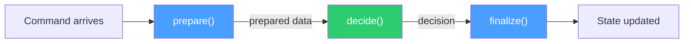

# Prepare → Decide → Finalize

> Separate I/O from business decisions by splitting state handlers into three phases:
> gather data, make a pure decision, then apply side effects.

## Problem

State machine handlers in Temporal workflows often mix I/O (database reads, API calls,
Elasticsearch indexing) with business logic (should this transition be allowed? what
state comes next?). This creates three problems:

1. **Untestable decisions.** Testing a handler that calls three activities requires
   mocking all three, even when you only want to test the decision branch.

2. **Opaque decisions.** When branch logic is interleaved with `await`s, the decision is
   smeared across the handler and depends on intermediate activity results. Replay is not
   the danger — activity results are read back from history — but the event history shows
   *what* happened, not *why*, and the "why" cannot be examined without re-running the I/O.

3. **Unclear failure boundaries.** When a handler fails, it's ambiguous whether the
   failure was in the decision (a bug) or in the I/O (an infrastructure issue that
   Temporal should retry).

## Solution

Split every state handler into three phases with strict rules about what each phase
may do:

| Phase | Side Effects? | Purpose |
|---|---|---|
| **Prepare** | ✅ Activities allowed | Gather data, perform reservations, fetch external state |
| **Decide** | ❌ Must be pure & synchronous | Compute the next state, context updates, and response |
| **Finalize** | ✅ Activities allowed | Apply side effects: index to ES, send notifications, start child workflows |



### Rules

1. **`decide` is synchronous.** It must not call activities, must not throw, and must
   not perform I/O. It receives the command and any data gathered by `prepare`, and
   returns the decision: next state, context updates, and response.

2. **`decide` must not read the clock or randomness.** In the TypeScript sandbox
   `Date.now()` and `Math.random()` are deterministic, so this is a *purity* rule, not a
   replay-safety rule: time and IDs are inputs — stamped by the caller in the command
   metadata, or produced in `prepare` — so the decision is a function of its arguments
   alone and a test can pin them.

3. **`prepare` results are passed as a parameter to `decide`.** The prepare phase
   gathers everything the decision needs; the decision never reaches back to fetch
   more data.

4. **`finalize` runs only after a successful decision.** If `decide` rejects the
   command (returns a rejection response), `finalize` is skipped entirely.

5. **Activity errors in `prepare` or `finalize` are retried by Temporal.** Decision
   errors are bugs. This separation makes the failure boundary unambiguous.

## Example

A checkout workflow handling a "set shipping address" command:

```typescript
interface SetShippingHandler {
  prepare(command: SetShippingCommand, ctx: CheckoutContext): Promise<PreparedShipping>;
  decide(command: SetShippingCommand, ctx: CheckoutContext, prepared: PreparedShipping): ShippingDecision;
  finalize(ctx: CheckoutContext, decision: ShippingDecision): Promise<void>;
}

// Phase 1: Gather data via activities
async function prepare(
  command: SetShippingCommand,
  ctx: CheckoutContext,
): Promise<PreparedShipping> {
  const [shippingCost, tax] = await Promise.all([
    calculateShipping(command.address, ctx.items),
    calculateTax(command.address, ctx.items),
  ]);
  // The caller stamped `meta.timestamp` when it sent the command; prepare passes it
  // through so decide sees time as data. A prepare that needs its own timestamp may
  // use `Date.now()` — deterministic inside the sandbox.
  return { shippingCost, tax, timestamp: command.meta.timestamp };
}

// Phase 2: Pure decision — no I/O, no throws
function decide(
  command: SetShippingCommand,
  ctx: CheckoutContext,
  prepared: PreparedShipping,
): ShippingDecision {
  const allowedSteps = ['shipping', 'payment', 'review'];
  if (!allowedSteps.includes(ctx.step)) {
    return {
      accepted: false,
      reason: `Cannot set shipping from step: ${ctx.step}`,
    };
  }

  return {
    accepted: true,
    nextState: 'payment',
    contextUpdates: {
      shippingAddress: command.address,
      shippingCost: prepared.shippingCost,
      tax: prepared.tax,
      updatedAt: prepared.timestamp,
    },
  };
}

// Phase 3: Side effects after the decision
async function finalize(
  ctx: CheckoutContext,
  decision: ShippingDecision,
): Promise<void> {
  if (!decision.accepted) return;
  await indexCheckout(buildCheckoutDocument(ctx));
}
```

### Testing the decision in isolation

The payoff: testing `decide` requires zero mocks, zero Temporal infrastructure, and
runs in milliseconds:

```typescript
describe('setShipping decide', () => {
  it('rejects from processing step', () => {
    const command = makeSetShippingCommand({ address: validAddress });
    const ctx = makeCheckoutContext({ step: 'processing' });
    const prepared = { shippingCost: 5.99, tax: 1.20, timestamp: '2026-01-01T00:00:00Z' };

    const decision = decide(command, ctx, prepared);

    expect(decision.accepted).toBe(false);
    expect(decision.reason).toContain('Cannot set shipping from step: processing');
  });

  it('advances to payment from shipping step', () => {
    const command = makeSetShippingCommand({ address: validAddress });
    const ctx = makeCheckoutContext({ step: 'shipping' });
    const prepared = { shippingCost: 5.99, tax: 1.20, timestamp: '2026-01-01T00:00:00Z' };

    const decision = decide(command, ctx, prepared);

    expect(decision.accepted).toBe(true);
    expect(decision.nextState).toBe('payment');
    expect(decision.contextUpdates.shippingCost).toBe(5.99);
  });
});
```

## Provenance

This pattern is a direct application of two established ideas:

1. **Functional Core, Imperative Shell** (Gary Bernhardt, 2012). The decision function
   is the functional core — pure, synchronous, testable. The prepare and finalize phases
   are the imperative shell — I/O, side effects, retries. The Temporal activity boundary
   maps cleanly onto this separation.

2. **The Decider Pattern** (Jérémie Chassaing). In its full form, the decider splits
   further into `decide(command, state) → events` and `evolve(state, event) → state`,
   which this catalog covers separately as the
   [Chassaing Decider](../chassaing-decider/) pattern. Prepare → Decide → Finalize is
   the workflow-level application of the same idea, with `prepare` and `finalize` as the
   Temporal-specific I/O bookends.

The pattern also draws from the Command pattern in domain-driven design: commands carry
all the data a handler needs, and the handler is structured as validation → decision →
side effects.

## Gotchas

1. **Clock reads belong in `prepare` (or the caller), not `decide`.** A `Date.now()`
   inside `decide` will not break replay — the sandbox patches it — but it makes the
   decision untestable without faking the clock and hides a dependency. Take timestamps
   from the command metadata or from `prepare`, and pass them in as data. The lint rule in
   [Enforcement Mechanisms](../../reference/enforcement-mechanisms.md) bans `Date` inside
   any function named `decide`.

2. **`decide` must not throw for rejected commands.** A rejected command is a valid
   business outcome (`{ accepted: false, reason: "..." }`), not an exception. Reserve
   `throw` for genuine programming errors. This keeps the control flow predictable and
   the response type uniform.

3. **Don't skip `finalize` for performance.** It's tempting to inline the ES indexing
   call after `decide` to save a function call. But the phase separation is what makes
   the pattern testable — collapsing it defeats the purpose.

4. **Activity results from `prepare` should be small and serializable.** The prepared
   data crosses the phase boundary inside the workflow; keep it lean.

## References

- Gary Bernhardt, [Functional Core, Imperative Shell](https://www.destroyallsoftware.com/screencasts/catalog/functional-core-imperative-shell) (2012)
- Jérémie Chassaing, [Functional Event Sourcing Decider](https://thinkbeforecoding.com/post/2021/12/17/functional-event-sourcing-decider) (2021)
- [Chassaing Decider](../chassaing-decider/) — the further decomposition of `decide` into `decide → events` + `evolve`
- [Two-File Activity](../two-file-activity/) — the companion pattern for keeping I/O out of the sandbox
