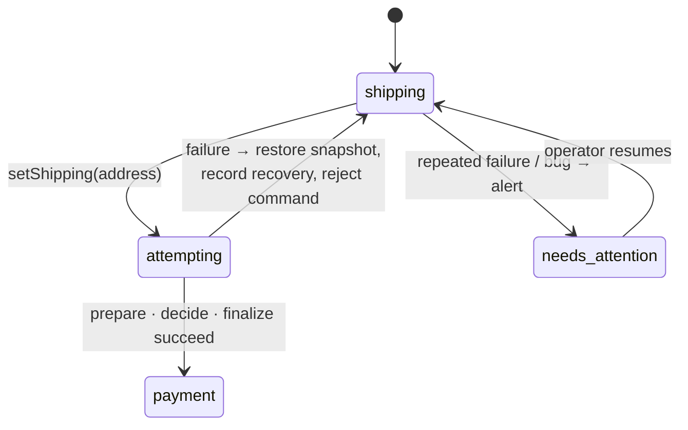

# Redemptive State Recovery

> When a workflow operation fails, return to the last known good state instead of
> crashing — the user's data must never be lost. Recovery is a state transition,
> not a database reconciliation.

## Problem

An entity workflow is mid-transition — a checkout is moving from `shipping` to `payment`
— and something fails: the shipping-rate activity exhausts its retries, the projection
write fails, or a bug in the handler throws. The default outcome is that the *workflow*
fails. For a batch job that is correct: fail fast, fix, rerun. For an entity a person is
using right now it is a disaster dressed as correctness: the checkout is dead, the shopper
sees an error page, their address and selections are gone, and an operator has to
reconstruct what happened from history.

The damage is out of proportion to the fault. The entity's state *before* the transition
was perfectly good.

## Solution

Treat failure as a **transition back to the last known good state**, recorded like any
other transition, and keep the entity alive and accepting commands:



### Rules

1. **The last good state is a value, not a rollback.** Because transitions produce a *new*
   context (see [Prepare → Decide → Finalize](../prepare-decide-finalize/)), redemption is
   simply *not assigning* the result. No undo log, no reconciliation.

2. **Failures are bounded.** Activities must have a finite retry policy
   (`maximumAttempts`), or the failure never arrives and the transition hangs instead of
   being redeemed.

3. **Classify, then act.** An `ActivityFailure` is infrastructure: reject the command,
   record the recovery, stay in the current state — the caller may retry later. Anything
   else thrown from a transition is a bug: record it, alert, and move to a
   `needs_attention` state that waits for a human (or a deploy) rather than re-running the
   same code into the same wall.

4. **Cancellation is not redeemed.** Let `CancelledFailure` propagate. A cancelled
   workflow is a decision, not a fault.

5. **Record every recovery.** A recovery is an event in the entity's life; it goes through
   the same transition-recording path as a successful transition, and the caller gets a
   rejection with the reason — never a silent "nothing happened".

6. **Side effects already applied are the saga's problem, not redemption's.** Restoring
   the workflow's state does not un-send an email. Make `finalize` steps idempotent, order
   them so the irreversible one is last, or compensate explicitly.

## Example

```typescript file=attempt.ts
import { ActivityFailure, isCancellation, log } from '@temporalio/workflow';

export type Attempt<T> =
  | { ok: true; value: T }
  | { ok: false; kind: 'infrastructure' | 'bug'; error: string };

/** Run one transition. Infrastructure failures and bugs are reported, not thrown; cancellation passes through. */
export async function attempt<T>(fn: () => Promise<T>): Promise<Attempt<T>> {
  try {
    return { ok: true, value: await fn() };
  } catch (err) {
    if (isCancellation(err)) throw err;                                  // Rule 4
    if (err instanceof ActivityFailure) {                                 // Rule 3: infrastructure
      return { ok: false, kind: 'infrastructure', error: err.cause?.message ?? err.message };
    }
    log.error('transition threw a non-activity error — treating as a bug', { error: String(err) });
    return { ok: false, kind: 'bug', error: err instanceof Error ? err.message : String(err) };
  }
}
```

```typescript file=activities.ts
import type { CheckoutContext } from './workflows';
export interface CheckoutActivities {
  calculateShipping(address: string): Promise<number>;
  indexCheckout(ctx: CheckoutContext): Promise<void>;
  recordRecovery(checkoutId: string, transition: string, kind: 'infrastructure' | 'bug', error: string): Promise<void>;
  alertOps(checkoutId: string, error: string): Promise<void>;
}
```

```typescript file=workflows.ts
import { condition, defineSignal, defineUpdate, proxyActivities, setHandler } from '@temporalio/workflow';
import { attempt } from './attempt';
import type { CheckoutActivities } from './activities';

const { calculateShipping, indexCheckout, recordRecovery, alertOps } = proxyActivities<CheckoutActivities>({
  startToCloseTimeout: '10s',
  retry: { maximumAttempts: 4 },      // Rule 2: bounded, so failure arrives and can be redeemed
});

export type CheckoutStep = 'shipping' | 'payment' | 'needs_attention';
export interface CheckoutContext {
  checkoutId: string;
  step: CheckoutStep;
  address: string | null;
  shippingCost: number | null;
  recoveries: number;
}
export type SetShippingResult = { accepted: true; ctx: CheckoutContext } | { accepted: false; reason: string };
export const setShippingUpdate = defineUpdate<SetShippingResult, [string]>('checkout.setShipping');
export const resumeSignal = defineSignal('checkout.resume');
export const finishSignal = defineSignal('checkout.finish');

// One transition: prepare → decide → finalize, returning a NEW context.
async function setShipping(ctx: CheckoutContext, address: string): Promise<CheckoutContext> {
  const shippingCost = await calculateShipping(address);                              // prepare
  const next: CheckoutContext = { ...ctx, address, shippingCost, step: 'payment' };   // decide
  await indexCheckout(next);                                                           // finalize
  return next;
}

export async function checkoutWorkflow(initial: CheckoutContext): Promise<CheckoutContext> {
  let ctx = initial;      // Rule 1: the last known good state; replaced only by a whole successful transition
  let done = false;

  setHandler(setShippingUpdate, async (address) => {
    if (ctx.step !== 'shipping') return { accepted: false, reason: `cannot set shipping in step '${ctx.step}'` };

    const result = await attempt(() => setShipping(ctx, address));
    if (result.ok) {
      ctx = result.value;
      return { accepted: true, ctx };
    }

    // Redemption: ctx was never reassigned — the entity is alive and still in 'shipping'.
    ctx = { ...ctx, recoveries: ctx.recoveries + 1 };
    await recordRecovery(ctx.checkoutId, 'setShipping', result.kind, result.error);   // Rule 5
    if (result.kind === 'bug' || ctx.recoveries >= 3) {                                // Rule 3
      ctx = { ...ctx, step: 'needs_attention' };
      await alertOps(ctx.checkoutId, result.error);
    }
    return { accepted: false, reason: result.error };
  });
  setHandler(resumeSignal, () => { if (ctx.step === 'needs_attention') ctx = { ...ctx, step: 'shipping', recoveries: 0 }; });
  setHandler(finishSignal, () => { done = true; });

  await condition(() => done);
  return ctx;
}
```

The shopper who hit the failure sees "we couldn't calculate shipping, please try again"
instead of an error page; their address is still in the form; the workflow is still
running; and `recordRecovery` has written exactly what happened, where the next person
can find it.

## Provenance

The principle — "return to the last good state; the user's data must never be lost" — is
older than Temporal; the form here is first-party, from a checkout whose projection
activity exhausted its retries during a search-cluster incident and failed the workflow,
taking the shopper's in-progress checkout with it. The cart was fine; the checkout was
gone. The fix was structural: transitions return new contexts, a failed transition is a
recorded event that leaves the context alone, and the
[State Machine Driver](../state-machine-driver/) now wraps every state function in the
equivalent of `attempt()`, with the classification and the `needs_attention` escalation
as configurable hooks. The name was the team's.

## Gotchas

1. **Unbounded retries mean no redemption.** The default retry policy retries forever
   (with backoff). A transition whose activity never fails never recovers either — it just
   hangs in the attempt. Set `maximumAttempts` (or `scheduleToCloseTimeout`) on every
   activity in a transition.

2. **Never catch cancellation.** `isCancellation(err)` first, always. Swallowing a
   `CancelledFailure` leaves a workflow that refuses to die.

3. **Do not auto-retry the command in a loop.** A command that fails for a deterministic
   reason (a bug, a permanently invalid address) will fail every time. Reject it, record
   it, and let the caller — or an operator — decide. Auto-retry belongs in the activity's
   retry policy, where it is bounded.

4. **Partial finalize.** If `finalize` is three writes and the second fails, the first
   happened. Restoring `ctx` does not undo it. Order finalize steps so the irreversible one
   is last, make each idempotent, and if that is impossible, compensate — see the official
   Saga pattern.

5. **`needs_attention` needs a way out.** A resume signal (as in the example), a timer
   that retries once an hour, or both. A terminal-looking state that is not actually
   terminal is a workflow that lives forever with no one noticing.

6. **Bugs are redeemed only until the fix ships.** Keeping the entity alive through a
   bug is the point — it gives you time to deploy. But the same code will fail the same
   way until then; do not expect `resume` to help before a fix.

## References

- [Prepare → Decide → Finalize](../prepare-decide-finalize/) — transitions that return new contexts, which is what makes redemption a non-assignment
- [State Machine Driver](../state-machine-driver/) — where `attempt()` lives in framework form
- [Temporal Design Patterns — Distributed Transaction: Saga](https://docs.temporal.io/design-patterns/distributed-transaction-patterns) — compensating side effects redemption cannot undo
- [Temporal TypeScript SDK — Activity timeouts and retries](https://docs.temporal.io/develop/typescript/activities/timeouts)
