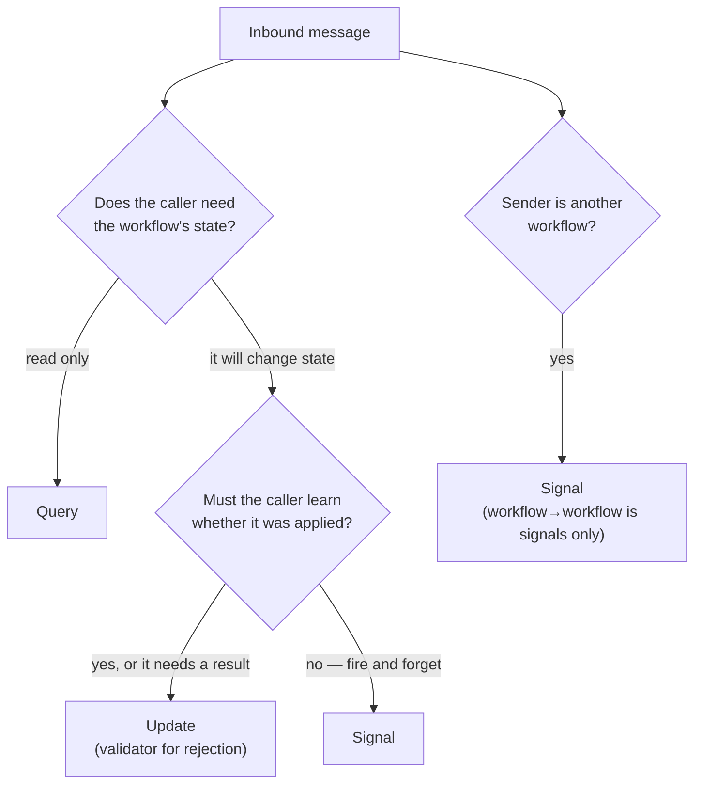

# Signals, Updates & Queries

> Choose the right Temporal communication primitive: Queries for reads, Updates for
> confirmed mutations with return values, Signals for fire-and-forget notifications.

## Problem

Temporal gives a running workflow three inbound channels, and they are not
interchangeable. Teams that learned Temporal before Workflow Update existed tend to reach
for the signal-then-query pair for everything, which produces a recognizable set of bugs:

- **Lost writes that look like successes.** A signal is recorded and the call returns
  before the handler runs. The caller assumes the mutation happened; the handler rejects
  it; nobody is told.
- **Request/response built from signal + query.** Send a signal, poll a query until the
  state changes. Racy, slow, and it cannot distinguish "not applied yet" from "rejected".
- **Queries used as commands.** A query handler that mutates state "works" in development
  and corrupts state under replay, because queries are not recorded in history.
- **Updates used where a notification would do.** An `executeUpdate` that the caller does
  not actually wait on, blocking a request path on a worker round trip for no reason.

## Solution

One table, three questions:

| Primitive | Recorded in history? | Returns a value? | Can be rejected? | Handler may `await`? | Use when |
|---|---|---|---|---|---|
| **Query** | No | Yes | No (throws) | No — synchronous, read-only | The caller wants to *read* state |
| **Signal** | Yes | No | No | Yes | The caller wants to *notify* and does not need an answer |
| **Update** | Yes | Yes | Yes — validator runs first | Yes | The caller wants to *mutate* and must know the outcome |



### Rules

1. **Mutation the caller must confirm → Update.** Add to cart, set shipping address,
   approve an order. The update's return value is the response; the validator is the
   rejection path. Do not send a signal and then query.

2. **Notification the caller does not wait on → Signal.** "Payment webhook arrived",
   "inventory changed", "abandon this cart". If the workflow rejecting it would not change
   what the sender does next, it is a signal.

3. **Read → Query, and queries never write.** A query handler is a pure function of
   workflow state. No activities, no assignments, no timers.

4. **Workflow-to-workflow → Signal.** `getExternalWorkflowHandle()` supports `signal()` and
   `cancel()` only. A workflow cannot update or query another workflow; it can signal it,
   or it can call an activity that uses a client.

5. **Validate in the validator, work in the handler.** The validator is synchronous and
   runs before the update is recorded, so a rejected update leaves no trace in history and
   costs the caller one round trip. The handler may await activities; the validator may not.

6. **Register all handlers synchronously at the top of the workflow function** — before
   the first `await` — so messages delivered in the first workflow task have somewhere to go.

## Example

One cart, one of each primitive. The definitions live in a file both the workflow and the
web app can import (see [Definitions File](../definitions-file/)).

```typescript file=definitions.ts
import { defineQuery, defineSignal, defineUpdate } from '@temporalio/workflow';

export interface CartView {
  items: Record<string, number>;   // sku → quantity
  total: number;
}
export interface AddItemCommand { sku: string; qty: number; unitPrice: number }

export const getCartQuery  = defineQuery<CartView>('getCart');                       // read
export const addItemUpdate = defineUpdate<CartView, [AddItemCommand]>('addItem');   // confirmed mutation
export const abandonSignal = defineSignal<[string]>('abandon');                    // notification
```

```typescript file=workflows.ts
import { condition, setHandler } from '@temporalio/workflow';
import { abandonSignal, addItemUpdate, getCartQuery } from './definitions';
import type { CartView } from './definitions';

export async function cartWorkflow(): Promise<CartView> {
  const cart: CartView = { items: {}, total: 0 };
  let abandonedBecause: string | null = null;

  // Query: pure read of current state.
  setHandler(getCartQuery, () => cart);

  // Update: validator rejects without touching history; handler applies and answers.
  setHandler(
    addItemUpdate,
    ({ sku, qty, unitPrice }) => {
      cart.items[sku] = (cart.items[sku] ?? 0) + qty;
      cart.total += qty * unitPrice;
      return cart;
    },
    {
      validator: ({ sku, qty }) => {
        if (qty <= 0) throw new Error(`qty must be positive for ${sku}`);
      },
    },
  );

  // Signal: the sender moves on; the workflow reacts when it gets to it.
  setHandler(abandonSignal, (reason) => { abandonedBecause = reason; });

  await condition(() => abandonedBecause !== null);
  return cart;
}
```

```typescript file=client.ts
import { Client } from '@temporalio/client';
import { abandonSignal, addItemUpdate, getCartQuery } from './definitions';

const client = new Client();
const handle = client.workflow.getHandle('store-001.cart.c-42');

const after = await handle.executeUpdate(addItemUpdate, {
  args: [{ sku: 'sku-1', qty: 2, unitPrice: 9.5 }],
});                                                    // the response IS the new state
const view = await handle.query(getCartQuery);         // a read, any time
await handle.signal(abandonSignal, 'session expired'); // no answer expected
console.log(after.total === view.total);
```

## Provenance

The three primitives and their semantics are the SDK's; the official Workflow-Messaging
patterns cover Signal-with-Start and Request-Response via Updates. The decision rules here
are first-party, distilled from migrating a storefront that predated Workflow Update: its
add-to-cart path was signal + query polling, and the "mutation the caller must confirm →
Update" rule removed a class of "item didn't appear" bug reports at a stroke. Rule 4
(workflow-to-workflow is signals only) is the constraint most often rediscovered the hard
way in cross-domain designs.

## Gotchas

1. **Queries need a worker, and may trigger a replay.** A query is answered by a worker
   that has the workflow in its cache — or loads it by replaying history. With no pollers on
   the task queue a query times out. Do not build a read path that assumes queries are
   "just a read from the server".

2. **Signal handlers interleave.** A signal handler that awaits an activity yields; the
   next signal's handler starts before the first finishes. If order matters, have handlers
   push to a queue that the main loop drains — the shape used by the
   [State Machine Driver](../state-machine-driver/).

3. **Updates are delivered to a worker, not just recorded.** `executeUpdate` blocks until
   the handler returns; if no worker is running, it waits. Request paths should set a
   client-side timeout.

4. **TypeScript narrowing breaks across `condition()`.** The handler-writes, loop-reads
   pattern in the example is exactly where
   [Narrowing Across `condition()`](../../gotchas/narrowing-across-condition.md) bites.

5. **Unfinished handlers are abandoned at exit.** Every exit point must wait for
   [`allHandlersFinished`](../all-handlers-finished/); this applies to signal handlers as
   much as update handlers.

6. **`description` is free documentation.** `setHandler(def, fn, { description })` shows
   up in `temporal workflow describe` and the UI. Use it.

## References

- [Temporal TypeScript SDK — Message passing](https://docs.temporal.io/develop/typescript/workflows/message-passing)
- [Temporal — Workflow message passing (encyclopedia)](https://docs.temporal.io/encyclopedia/workflow-message-passing)
- [Temporal Design Patterns — Workflow Messaging](https://docs.temporal.io/design-patterns/workflow-messaging-patterns)
- [Definitions File](../definitions-file/) — where the `define*` calls live
- [`updateWithStart`](../update-with-start/) — update + lazy creation in one call
- [`allHandlersFinished`](../all-handlers-finished/) — finishing what these handlers start
- [State Machine Driver](../state-machine-driver/) — multiplexing all three into one loop
