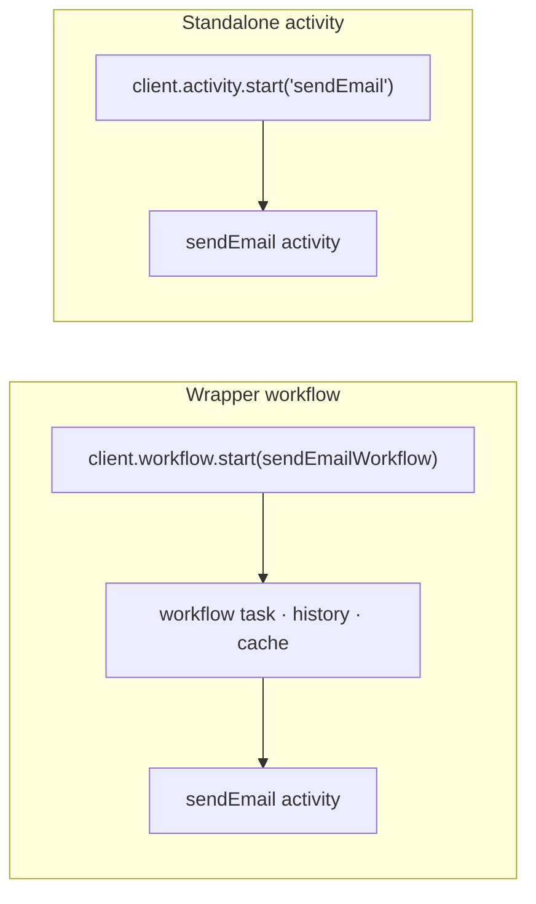

# Standalone Activities

> When a workflow's only job is to call a single activity with no state or
> sequencing, skip the workflow shell entirely and invoke the activity directly
> through the Temporal client.

## Problem

Every Temporal codebase grows a shelf of *wrapper workflows*: `sendEmailWorkflow`,
`syncCustomerWorkflow`, `generateThumbnailWorkflow` — each one a workflow function whose
entire body is `return await doTheThing(input)`. They exist because, historically, the
only thing a client could start was a workflow, and the only way to get Temporal's
retries, timeouts, and visibility for a single call was to wrap it.

The wrapper is not free. Each call creates a workflow execution — history events, a
workflow task, a slot in the worker's workflow cache, a replay on every eviction — plus a
workflow definition to maintain, an ID scheme, and an entry in the catalog of things that
can be non-deterministic. For a one-line body, all of that is overhead with no benefit.

## Solution

Start the activity **directly from the client**: the TypeScript SDK's `client.activity`
(Standalone Activities, marked `@experimental` as of SDK 1.22) runs a single activity
with the same retry policy, timeouts, heartbeating, cancellation, and visibility an
activity gets inside a workflow — and no workflow.



### The decision rule

Use a standalone activity when **all** of these hold:

1. The work is **one activity** — one call, one result.
2. There is **no state** between calls and nothing to remember afterwards.
3. There is **no sequencing, compensation, or branching** — nothing to orchestrate.
4. Nobody needs to **signal, query, or update** it while it runs, and it sets no timers.

If any of the four fails, it is a workflow. The test is not "is it small?" but "is there
anything here that is *about* durability across steps?" A single call has no steps.

### Rules

1. **A meaningful `id`.** Activity IDs are business identifiers, not UUIDs —
   `email-order-42-confirmation` — and the natural idempotency key for client retries.
2. **Bounded timeouts and explicit retry**, exactly as for workflow-scheduled activities;
   the same `startToCloseTimeout`/`retry` options apply.
3. **The same worker serves it.** Register the implementation as you would any activity;
   the worker that polls that task queue runs it. No second deployment.
4. **Type it.** `client.activity.typed<MyActivities>()` checks the name, arguments, and
   result against the same interface the worker implements.
5. **Stop at one.** The moment the caller wants to start a second activity *after* the
   first, you are orchestrating in the client with no durability — that is the workflow
   you were avoiding. Promote it.

## Example

```typescript file=activities.ts
export interface EmailActivities {
  sendEmail(to: string, template: string, vars: Record<string, string>): Promise<{ messageId: string }>;
}
```

```typescript file=activities-impl.ts
import type { EmailActivities } from './activities';

export const activities = {
  async sendEmail(to, template, vars) {
    const res = await fetch('https://mail.internal.example/send', {
      method: 'POST',
      body: JSON.stringify({ to, template, vars }),
    });
    if (!res.ok) throw new Error(`mail provider ${res.status}`);
    return (await res.json()) as { messageId: string };
  },
} satisfies EmailActivities;
```

```typescript file=worker.ts
import { Worker } from '@temporalio/worker';
import { activities } from './activities-impl';

// An ordinary worker. It happens to serve no workflows on this queue — only activities.
const worker = await Worker.create({ activities, taskQueue: 'notifications' });
await worker.run();
```

```typescript file=client.ts
import { Client } from '@temporalio/client';
import type { EmailActivities } from './activities';

const client = new Client();
const email = client.activity.typed<EmailActivities>();     // Rule 4

export async function sendOrderConfirmation(orderId: string, to: string): Promise<string> {
  const handle = await email.start('sendEmail', {
    id: `email-order-${orderId}-confirmation`,               // Rule 1: business ID = idempotency key
    taskQueue: 'notifications',
    args: [to, 'order-confirmation', { orderId }],
    startToCloseTimeout: '30s',                              // Rule 2
    retry: { maximumAttempts: 5, initialInterval: '2s', backoffCoefficient: 2 },
  });
  const { messageId } = await handle.result();
  return messageId;
}
```

Compare with what this replaced — a workflow file, a workflow ID, and a history, for one
line of logic:

```typescript fragment
// ❌ the wrapper: a workflow whose whole body is one activity call
export async function sendEmailWorkflow(to: string, template: string, vars: Record<string, string>) {
  return sendEmail(to, template, vars);
}
```

## Provenance

Standalone Activities are a Temporal server and SDK feature (experimental in the
TypeScript SDK as of 1.22). The first-party contribution is the **decision rule** and the
**"stop at one" corollary**, formed while auditing a commerce codebase's worker registry:
of a dozen workflow types on the notifications queue, nine were single-activity wrappers.
Before the feature existed the honest alternatives were to keep the wrapper or to call the
provider directly with hand-rolled retries; the rule was still useful then as a marker —
"this is a wrapper; replace it when the platform allows" — and it is now actionable.

## Gotchas

1. **Experimental API.** `client.activity` is marked `@experimental` in SDK 1.22 —
   the shape may change between minor versions, and the server must support standalone
   activities. Pin the SDK version in a project that adopts it and read the release notes
   on upgrade. The *decision rule* does not depend on the API.

2. **The ID is the idempotency key — use it.** A client retry of `start()` with the same
   `id` while the first is still running is rejected as already-started; treat that as
   success and fetch the handle with `client.activity.getHandle(id)`. Random IDs throw that
   protection away.

3. **Two calls from the client is orchestration.** `await sendEmail(); await updateCrm();`
   in a request handler has no durability between the two. If the second must happen when
   the first did, that is a workflow with two activities.

4. **No workflow means no signals, queries, timers, or child workflows.** If a
   stakeholder asks "can we add an approval step?", the answer is "yes — by making it a
   workflow", not by bolting state onto a standalone activity.

5. **Visibility is separate.** Standalone activities are listed and searched in their own
   namespace view, not under a parent workflow. Dashboards that count "workflows" will not
   count them.

6. **Set a timeout.** As with any activity, the server requires either
   `startToCloseTimeout` or `scheduleToCloseTimeout`; omit both and the start is rejected.

## References

- [Temporal TypeScript SDK — Activities](https://docs.temporal.io/develop/typescript/activities)
- [Temporal TypeScript SDK — ActivityClient API reference](https://typescript.temporal.io/api/classes/client.ActivityClient)
- [Two-File Activity](../two-file-activity/) — the contract/implementation split the example uses
- [Unified Worker Topology](../unified-worker-topology/) — where the notifications worker lives
- [Workflow-per-Entity vs. Singleton](../workflow-per-entity-vs-singleton/) — the cardinality question for things that *are* workflows
