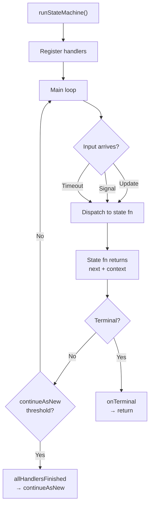

# State Machine Driver (`runStateMachine`)

> A reusable loop that wires Temporal signals, updates, queries, and timeouts into
> a state function table — so workflow authors declare states and transitions, and the
> framework handles everything else.

## Problem

Every entity workflow that accepts external commands (updates, signals) needs the same
boilerplate:

1. Register update and signal handlers with `setHandler`.
2. Block in a `condition()` loop waiting for input.
3. Dispatch input to the correct state function.
4. Apply the state transition (update `currentState` and context).
5. Handle timeouts per state (different states need different durations).
6. Guard `continueAsNew` with `allHandlersFinished`.
7. Track input counts toward a `continueAsNew` threshold.
8. Handle cancellation and terminal states.
9. Record transitions for observability.

Writing this loop by hand in every workflow is error-prone: forgetting
`allHandlersFinished` loses update responses, forgetting to count signals toward the
`continueAsNew` threshold causes history overflow, and dispatching timeouts incorrectly
creates the async predicate death loop.

## Solution

Factor the loop into a generic `runStateMachine` driver that owns the boilerplate and
delegates business logic to a **state registry** — a `Record<StateName, StateConfig>`
where each state declares its function, timeout, and whether it's transitional (advances
automatically without external input).



### The state function contract

Each state function receives the current context and a discriminated input, and returns
a `StateOutput`:

```typescript
// What arrives at a state function
type StateInput<TEvent, TSignal = never> =
  | { kind: 'event'; event: TEvent; timestamp: string }     // from an Update
  | { kind: 'signal'; result: TSignal; timestamp: string }   // from a Signal
  | { kind: 'timeout'; timestamp: string };                  // timer elapsed

// What a state function returns
interface StateOutput<TState, TContext, TResponse> {
  context: TContext;                          // the (possibly updated) context
  next: TState | `__terminal:${string}`;      // next state or terminal
  response?: TResponse;                       // returned to the Update caller
  error?: string;                             // error message for the caller
  rejected?: boolean;                         // true = no transition, no recording
}
```

### The state config

```typescript
interface StateConfig<TState, TEvent, TContext, TResponse, TSignal = never> {
  fn: (ctx: TContext, input: StateInput<TEvent, TSignal>)
    => Promise<StateOutput<TState, TContext, TResponse>>;
  timeout?: Duration | ((ctx: TContext) => Duration);   // per-state, optionally dynamic
  transitional?: boolean;  // auto-advance without waiting for external input
}

type StateRegistry<TState, TEvent, TContext, TResponse, TSignal = never> =
  Record<TState, StateConfig<TState, TEvent, TContext, TResponse, TSignal>>;
```

### The driver

```typescript
async function runStateMachine<TState, TEvent, TContext, TResponse, TSignal>(
  config: StateMachineConfig<TState, TEvent, TContext, TResponse, TSignal>,
  initialContext: TContext,
  updates: UpdateDefinition<TResponse, [TEvent]> | MappedUpdateRegistration[],
  signals?: SignalDefinition<[TSignal]> | SignalRegistration[],
): Promise<TContext> {
  let ctx = initialContext;
  let currentState = config.initialState;
  let inputCount = 0;

  // Register update handler(s) — writes to an exchange slot
  let pendingUpdate: UpdateExchange | null = null;
  setHandler(updateDef, (event) => {
    pendingUpdate = { event, processed: false };
    return condition(() => pendingUpdate?.processed === true);
  });

  // Register signal handler(s) — writes to a signal slot
  let pendingSignal: TSignal | null = null;
  setHandler(signalDef, (signal) => { pendingSignal = signal; });

  // Main loop
  while (!isTerminal(currentState)) {
    const stateConfig = config.states[currentState];
    const timeout = resolveTimeout(stateConfig.timeout, ctx);

    // Wait for input or timeout
    const gotInput = await condition(
      () => pendingUpdate !== null || pendingSignal !== null,
      timeout,
    );

    // Build the StateInput
    const input = buildInput(pendingUpdate, pendingSignal, gotInput);

    // Dispatch to state function
    const output = await stateConfig.fn(ctx, input);

    // Apply transition
    ctx = output.context;
    currentState = output.next;
    inputCount++;

    // Release the update caller with response or error
    if (pendingUpdate) {
      pendingUpdate.result = output.response;
      pendingUpdate.error = output.error;
      pendingUpdate.processed = true;
      pendingUpdate = null;
    }
    pendingSignal = null;

    // Lifecycle hooks
    if (!output.rejected) {
      config.onContextUpdate?.(ctx, currentState);
      await config.onTransition?.(fromState, currentState, event, ctx);
    }

    // continueAsNew guard
    if (inputCount >= (config.continueAsNewThreshold ?? 500)) {
      await condition(allHandlersFinished);
      await continueAsNew(config.serializeForContinueAsNew(ctx, currentState));
    }
  }

  // Terminal cleanup
  await config.onTerminal?.(ctx, currentState);
  return ctx;
}
```

### What the driver handles automatically

| Concern | How |
|---|---|
| **Handler registration** | `setHandler` for updates and signals, with exchange slots |
| **Input multiplexing** | Discriminated `StateInput` unifies updates, signals, and timeouts |
| **Per-state timeouts** | `timeout` on `StateConfig`, optionally a function of context |
| **Transitional states** | `transitional: true` — immediate re-entry without waiting for input |
| **`continueAsNew`** | Counts ALL inputs (updates + signals + timeouts), guards with `allHandlersFinished` |
| **Terminal states** | `__terminal:reason` convention — the driver exits the loop |
| **Rejection** | `rejected: true` on the output skips transition hooks and recording |
| **Cancellation** | Catches `CancellationScope`, calls `onCancellation` hook |
| **Transition recording** | Optional async sink that batches and flushes transition records |

## Example

A simplified order workflow using the driver:

```typescript
// types.ts
type OrderState = 'pending' | 'processing' | 'shipped';
type OrderEvent =
  | { type: 'approveOrder'; approvedBy: string }
  | { type: 'shipOrder'; trackingNumber: string };

// states.ts — state function table
const states: StateRegistry<OrderState, OrderEvent, OrderContext, OrderResponse> = {
  pending: {
    fn: async (ctx, input) => {
      if (input.kind === 'timeout') {
        return { context: ctx, next: '__terminal:expired' };
      }
      if (input.kind === 'event' && input.event.type === 'approveOrder') {
        await notifyWarehouse(ctx.orderId);
        return {
          context: { ...ctx, approvedBy: input.event.approvedBy },
          next: 'processing',
          response: { status: 'approved' },
        };
      }
      return { context: ctx, next: 'pending', rejected: true, error: 'Unexpected' };
    },
    timeout: '7 days',
  },

  processing: {
    fn: async (ctx, input) => {
      if (input.kind === 'event' && input.event.type === 'shipOrder') {
        await indexShipment(ctx.orderId, input.event.trackingNumber);
        return {
          context: { ...ctx, trackingNumber: input.event.trackingNumber },
          next: 'shipped',
        };
      }
      return { context: ctx, next: 'processing', rejected: true, error: 'Unexpected' };
    },
    timeout: '30 days',
  },

  shipped: {
    fn: async (ctx, _input) => ({
      context: ctx,
      next: '__terminal:delivered',
    }),
    transitional: true,  // auto-advances to terminal
  },
};

// workflows.ts — the workflow is 5 lines
export async function orderWorkflow(input: OrderInput): Promise<OrderContext> {
  return runStateMachine(
    { states, initialState: 'pending', onTerminal: finalizeOrder },
    buildInitialContext(input),
    orderUpdateDef,
  );
}
```

## Provenance

The `runStateMachine` driver is a first-party framework. Its design draws from two sources:

1. **The Temporal entity workflow pattern.** Every entity workflow has the same shape:
   register handlers, loop on `condition`, dispatch, transition, guard lifecycle. The
   SDK samples show this loop inline in each workflow; the driver factors it out.

2. **State machine theory.** The state registry is a finite state machine: a set of
   named states, each with a transition function, composed with Temporal's durability
   guarantees. Terminal states use a `__terminal:reason` convention that embeds the
   exit reason in the state name.

The framework was developed incrementally: first as a thin loop extraction, then
extended with per-state timeouts, transitional states, rejection semantics,
`continueAsNew` guarding, transition recording (async batched persistence of every
state change for observability), and projection lifecycle management.

## Gotchas

1. **State functions run inside the workflow sandbox.** The function itself can call
   activities (for prepare/finalize), but must not import Node built-ins or database
   drivers directly. Use the [Two-File Activity](../two-file-activity/) pattern.

2. **`transitional` states must eventually exit.** A transitional state that returns
   itself as `next` creates an infinite loop. The driver does not detect cycles —
   the author must ensure transitional chains terminate.

3. **Timeout duration can be a function.** Use `(ctx) => ctx.pollInterval` when
   different entity configurations need different poll cadences. The function is
   called each loop iteration, so it can adapt as context changes.

4. **Signal-driven workflows need `continueAsNew` too.** The driver counts ALL inputs
   (updates, signals, and timeouts), not just updates. A purely signal-driven workflow
   (e.g., an account lifecycle) grows history with every signal — counting only updates
   would never trigger `continueAsNew`.

5. **Workers do not hot-reload workflow code.** After changing state functions, restart
   the worker. The new code takes effect for new workflow tasks.

## References

- [Temporal Entity Workflow pattern](https://docs.temporal.io/design-patterns/entity-workflow) — the SDK-level pattern this driver implements
- [Two-File Activity](../two-file-activity/) — keeping I/O out of state functions
- [Prepare → Decide → Finalize](../prepare-decide-finalize/) — the internal structure of each state function
- [Chassaing Decider](../chassaing-decider/) — the pure core inside the state function
- [`allHandlersFinished`](../all-handlers-finished/) — the lifecycle guard the driver uses
- [`continueAsNew`](../continue-as-new/) — the history-reset mechanism the driver manages
