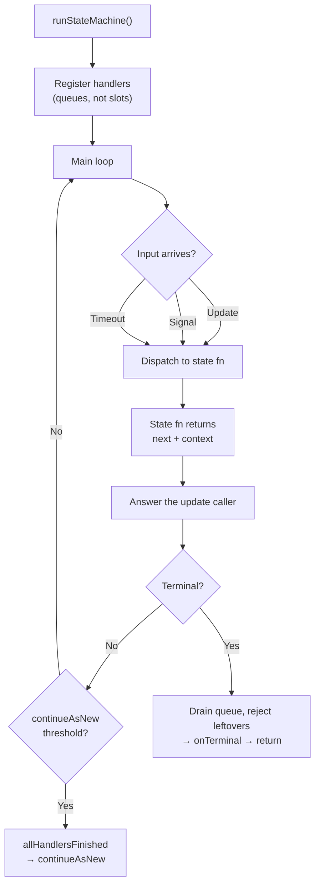

# State Machine Driver (`runStateMachine`)

> A reusable loop that wires Temporal signals, updates, queries, and timeouts into
> a state function table — so workflow authors declare states and transitions, and the
> framework handles everything else.

## Problem

Every entity workflow that accepts external commands (updates, signals) needs the same
boilerplate:

1. Register update and signal handlers with `setHandler`.
2. Block in a `condition()` loop waiting for input.
3. Dispatch input to the correct state function.
4. Apply the state transition (update `currentState` and context).
5. Handle timeouts per state (different states need different durations).
6. Guard `continueAsNew` with `allHandlersFinished`.
7. Track input counts toward a `continueAsNew` threshold.
8. Handle cancellation and terminal states.
9. Record transitions for observability.

Writing this loop by hand in every workflow is error-prone: forgetting
`allHandlersFinished` loses update responses, forgetting to count signals toward the
`continueAsNew` threshold causes history overflow, holding a pending update in a single
variable instead of a queue drops the second of two concurrent updates, and dispatching
timeouts incorrectly creates the async predicate death loop.

## Solution

Factor the loop into a generic `runStateMachine` driver that owns the boilerplate and
delegates business logic to a **state registry** — a `Record<StateName, StateConfig>`
where each state declares its function, timeout, and whether it's transitional (advances
automatically without external input).



### The state function contract

Each state function receives the current context and a discriminated input, and returns
a `StateOutput`:

```typescript
// What arrives at a state function
type StateInput<TEvent, TSignal = never> =
  | { kind: 'event'; event: TEvent; timestamp: string }     // from an Update
  | { kind: 'signal'; result: TSignal; timestamp: string }   // from a Signal
  | { kind: 'timeout'; timestamp: string };                  // timer elapsed (or transitional)

type Terminal = `__terminal:${string}`;

// What a state function returns
interface StateOutput<TState extends string, TContext, TResponse> {
  context: TContext;                          // the (possibly updated) context
  next: TState | Terminal;                    // next state or terminal
  response?: TResponse;                       // returned to the Update caller
  error?: string;                             // thrown to the Update caller
  rejected?: boolean;                         // true = no transition, no recording
}
```

### The state config

```typescript
interface StateConfig<TState extends string, TEvent, TContext, TResponse, TSignal = never> {
  fn: (ctx: TContext, input: StateInput<TEvent, TSignal>)
    => Promise<StateOutput<TState, TContext, TResponse>>;
  timeout?: Duration | ((ctx: TContext) => Duration);   // per-state, optionally dynamic
  transitional?: boolean;  // auto-advance without waiting for external input
}

type StateRegistry<TState extends string, TEvent, TContext, TResponse, TSignal = never> =
  Record<TState, StateConfig<TState, TEvent, TContext, TResponse, TSignal>>;

interface StateMachineConfig<TState extends string, TEvent, TContext, TResponse, TSignal = never> {
  states: StateRegistry<TState, TEvent, TContext, TResponse, TSignal>;
  initialState: TState;
  continueAsNewThreshold?: number;                                   // default 500 inputs
  serializeForContinueAsNew: (ctx: TContext, state: TState) => unknown[];
  onTransition?: (from: TState, to: TState | Terminal, ctx: TContext) => Promise<void>;
  onTerminal?: (ctx: TContext, state: Terminal) => Promise<void>;
}
```

### The driver

The code below is abridged (cancellation handling, transition recording, and multi-update
registration are omitted) but every line that *is* shown reflects the semantics the
driver must have. Two of them are easy to get wrong and are called out inline: updates go
through a **queue**, and each handler waits on **its own** exchange object.

```typescript
import {
  allHandlersFinished, ApplicationFailure, condition, continueAsNew, setHandler,
} from '@temporalio/workflow';
import type { Duration, SignalDefinition, UpdateDefinition } from '@temporalio/workflow';

const isTerminal = (s: string): s is Terminal => s.startsWith('__terminal:');

interface UpdateExchange<TEvent, TResponse> {
  event: TEvent;
  processed: boolean;
  result?: TResponse;
  error?: string;
}

export async function runStateMachine<
  TState extends string, TEvent, TContext, TResponse, TSignal = never,
>(
  config: StateMachineConfig<TState, TEvent, TContext, TResponse, TSignal>,
  initialContext: TContext,
  updateDef: UpdateDefinition<TResponse, [TEvent]>,
  signalDef?: SignalDefinition<[TSignal]>,
): Promise<TContext> {
  let ctx = initialContext;
  let currentState: TState | Terminal = config.initialState;
  let inputCount = 0;

  // FIFO queues — never single slots. Two inputs that arrive in the same workflow
  // task must both be processed, in order, and both callers must be answered.
  const updateQueue: UpdateExchange<TEvent, TResponse>[] = [];
  const signalQueue: TSignal[] = [];

  // Each update handler owns its exchange object and waits on THAT object — never on
  // a shared variable the main loop reassigns, or the handler hangs forever.
  setHandler(updateDef, async (event: TEvent): Promise<TResponse> => {
    const entry: UpdateExchange<TEvent, TResponse> = { event, processed: false };
    updateQueue.push(entry);
    await condition(() => entry.processed);
    if (entry.error !== undefined) {
      throw ApplicationFailure.nonRetryable(entry.error);
    }
    return entry.result as TResponse;
  });
  if (signalDef) {
    setHandler(signalDef, (result: TSignal) => { signalQueue.push(result); });
  }

  const hasInput = () => updateQueue.length > 0 || signalQueue.length > 0;

  while (!isTerminal(currentState)) {
    const stateConfig = config.states[currentState];
    const timestamp = new Date().toISOString();   // sandbox-deterministic
    let input: StateInput<TEvent, TSignal>;
    let active: UpdateExchange<TEvent, TResponse> | undefined;

    if (stateConfig.transitional) {
      // Auto-advance: no wait. A synthesized timeout-shaped input keeps the contract uniform.
      input = { kind: 'timeout', timestamp };
    } else {
      const timeout = typeof stateConfig.timeout === 'function'
        ? stateConfig.timeout(ctx)
        : stateConfig.timeout;
      const woke = timeout === undefined
        ? await condition(hasInput).then(() => true)
        : await condition(hasInput, timeout);
      if (!woke) {
        input = { kind: 'timeout', timestamp };
      } else if (signalQueue.length > 0) {
        input = { kind: 'signal', result: signalQueue.shift()!, timestamp };
      } else {
        active = updateQueue.shift()!;
        input = { kind: 'event', event: active.event, timestamp };
      }
    }

    const from = currentState;
    const output = await stateConfig.fn(ctx, input);

    if (!output.rejected) {
      ctx = output.context;
      currentState = output.next;
      await config.onTransition?.(from, currentState, ctx);
    }

    // Answer the update caller — accepted or rejected, it always gets a reply.
    if (active) {
      active.result = output.response;
      active.error = output.error;
      active.processed = true;
    }

    inputCount++;
    if (!isTerminal(currentState) && inputCount >= (config.continueAsNewThreshold ?? 500)) {
      // A queued update IS an unfinished handler, so `condition(allHandlersFinished)`
      // alone would deadlock whenever something is waiting. Wake on either.
      await condition(() => allHandlersFinished() || hasInput());
      if (allHandlersFinished() && !hasInput()) {
        await continueAsNew(...config.serializeForContinueAsNew(ctx, currentState));
      }
      // else: loop once more, drain the queue, and retry the guard.
    }
  }

  // Terminal: answer anyone still queued so their handlers can finish, then exit.
  while (updateQueue.length > 0) {
    const entry = updateQueue.shift()!;
    entry.error = 'Workflow reached terminal state';
    entry.processed = true;
  }
  await condition(allHandlersFinished);
  await config.onTerminal?.(ctx, currentState);
  return ctx;
}
```

### What the driver handles automatically

| Concern | How |
|---|---|
| **Handler registration** | `setHandler` for updates and signals, each feeding a FIFO queue |
| **Input multiplexing** | Discriminated `StateInput` unifies updates, signals, and timeouts |
| **Per-state timeouts** | `timeout` on `StateConfig`, optionally a function of context |
| **Transitional states** | `transitional: true` — immediate re-entry without waiting for input |
| **`continueAsNew`** | Counts ALL inputs (updates + signals + timeouts); guards with `allHandlersFinished` *or* queued input |
| **Terminal states** | `__terminal:reason` convention — the driver drains the queue and exits the loop |
| **Rejection** | `rejected: true` on the output skips the transition and hooks; the caller still gets `response`/`error` |
| **Cancellation** | Catches `CancelledFailure`, calls `onCancellation` hook (omitted above) |
| **Transition recording** | Optional async sink that batches and flushes transition records (omitted above) |

## Example

A simplified order workflow using the driver:

```typescript
// types.ts
type OrderState = 'pending' | 'processing' | 'shipped';
type OrderEvent =
  | { type: 'approveOrder'; approvedBy: string }
  | { type: 'shipOrder'; trackingNumber: string };

// states.ts — state function table
const states: StateRegistry<OrderState, OrderEvent, OrderContext, OrderResponse> = {
  pending: {
    fn: async (ctx, input) => {
      if (input.kind === 'timeout') {
        return { context: ctx, next: '__terminal:expired' };
      }
      if (input.kind === 'event' && input.event.type === 'approveOrder') {
        await notifyWarehouse(ctx.orderId);
        return {
          context: { ...ctx, approvedBy: input.event.approvedBy },
          next: 'processing',
          response: { status: 'approved' },
        };
      }
      return { context: ctx, next: 'pending', rejected: true, error: 'Unexpected' };
    },
    timeout: '7 days',
  },

  processing: {
    fn: async (ctx, input) => {
      if (input.kind === 'event' && input.event.type === 'shipOrder') {
        await indexShipment(ctx.orderId, input.event.trackingNumber);
        return {
          context: { ...ctx, trackingNumber: input.event.trackingNumber },
          next: 'shipped',
        };
      }
      return { context: ctx, next: 'processing', rejected: true, error: 'Unexpected' };
    },
    timeout: '30 days',
  },

  shipped: {
    fn: async (ctx, _input) => ({
      context: ctx,
      next: '__terminal:delivered',
    }),
    transitional: true,  // auto-advances to terminal
  },
};

// workflows.ts — the workflow is 5 lines
export async function orderWorkflow(input: OrderInput): Promise<OrderContext> {
  return runStateMachine(
    { states, initialState: 'pending', onTerminal: finalizeOrder, serializeForContinueAsNew },
    buildInitialContext(input),
    orderUpdateDef,
  );
}
```

## Provenance

The `runStateMachine` driver is a first-party framework. Its design draws from two sources:

1. **The Temporal entity workflow pattern.** Every entity workflow has the same shape:
   register handlers, loop on `condition`, dispatch, transition, guard lifecycle. The
   SDK samples show this loop inline in each workflow; the driver factors it out.

2. **State machine theory.** The state registry is a finite state machine: a set of
   named states, each with a transition function, composed with Temporal's durability
   guarantees. Terminal states use a `__terminal:reason` convention that embeds the
   exit reason in the state name.

The framework was developed incrementally: first as a thin loop extraction, then
extended with per-state timeouts, transitional states, rejection semantics,
`continueAsNew` guarding, transition recording (async batched persistence of every
state change for observability), and projection lifecycle management. The queue-not-slot
and wait-on-own-entry rules were both learned the hard way — the first version of the
driver had exactly the two bugs described in the gotchas below.

## Gotchas

1. **State functions run inside the workflow sandbox.** The function itself can call
   activities (for prepare/finalize), but must not import Node built-ins or database
   drivers directly. Use the [Two-File Activity](../two-file-activity/) pattern.

2. **`transitional` states must eventually exit.** A transitional state that returns
   itself as `next` creates an infinite loop. The driver does not detect cycles —
   the author must ensure transitional chains terminate.

3. **Timeout duration can be a function.** Use `(ctx) => ctx.pollInterval` when
   different entity configurations need different poll cadences. The function is
   called each loop iteration, so it can adapt as context changes.

4. **Signal-driven workflows need `continueAsNew` too.** The driver counts ALL inputs
   (updates, signals, and timeouts), not just updates. A purely signal-driven workflow
   (e.g., an account lifecycle) grows history with every signal — counting only updates
   would never trigger `continueAsNew`.

5. **A single pending-update variable loses updates.** Two updates delivered in the same
   workflow task both run their handlers before the main loop wakes; with one slot the
   second overwrites the first, and the first caller waits forever. Use a FIFO queue.

6. **Handlers must wait on their own exchange object.** `condition(() =>
   pending?.processed)` closes over the *variable*; once the loop sets `pending = null`
   the predicate can never become true and the update caller hangs. Capture `const entry`
   and wait on `entry.processed`.

7. **`condition(allHandlersFinished)` can deadlock before `continueAsNew`.** A queued
   update is an in-flight handler. If the guard only waits for handlers to finish, and a
   handler is waiting for the loop, neither proceeds. Wake on *either* "all finished" or
   "input queued", and only `continueAsNew` when the queue is empty.

8. **Workers do not hot-reload workflow code.** After changing state functions, restart
   the worker — see [Worker Restart and Replay](../../gotchas/worker-restart-replay.md#workers-do-not-hot-reload-workflow-code).

## References

- [Temporal Entity Workflow pattern](https://docs.temporal.io/design-patterns/entity-workflow) — the SDK-level pattern this driver implements
- [Two-File Activity](../two-file-activity/) — keeping I/O out of state functions
- [Prepare → Decide → Finalize](../prepare-decide-finalize/) — the internal structure of each state function
- [Chassaing Decider](../chassaing-decider/) — the pure core inside the state function
- [`allHandlersFinished`](../all-handlers-finished/) — the lifecycle guard the driver uses
- [`continueAsNew`](../continue-as-new/) — the history-reset mechanism the driver manages
- [Async Predicate Death Loop](../../gotchas/async-predicate-death-loop.md) — why the driver owns the only `condition()` loop
