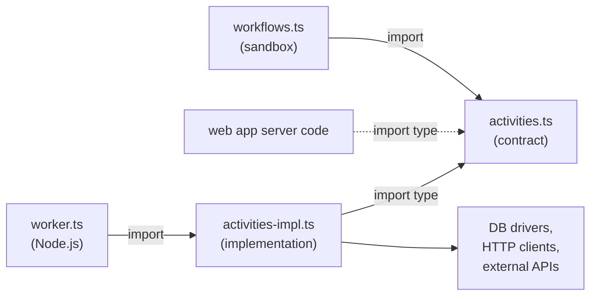

# Two-File Activity Pattern

> Structurally separate activity contracts from implementations so the workflow sandbox
> can never reach I/O code.

## Problem

Temporal workflow code runs in a deterministic sandbox. The SDK bundles the entire
module graph reachable from a workflow file into a V8 isolate. If a workflow file
imports an activity that imports a database driver, the sandbox tries to bundle the
driver — and either fails at build time or loads and misbehaves silently under replay.

The SDK's first-party solution is `import type * as activities` — a type-only import
that the TypeScript compiler erases before bundling. This keeps I/O code out of the
workflow bundle, but the safety boundary is a single keyword (`type`). Remove it and
the build breaks; worse, some third-party modules that appear type-safe actually
perform side effects at import time, and ESLint cannot detect this.

A second problem emerges in full-stack applications: the Next.js bundler (or any web
framework bundler) is a *third* consumer of Temporal-related code. The web app needs
type signatures and query/signal/update definitions to interact with workflows via the
Temporal client, but it must never bundle database drivers or Temporal worker internals.
A single `activities.ts` file cannot serve all three consumers safely.

## Solution

Split every domain's activities into two files:

| File | Imported by | Contains |
|---|---|---|
| `activities.ts` | Workflows (value import); web app server code (`import type` only, if it needs the DTO types) | `proxyActivities()` calls, the activity interface, DTO types, retry/timeout config — **no I/O** |
| `activities-impl.ts` | Worker entrypoint only | Real implementations with database clients, HTTP, anything |



### Rules

1. **`activities.ts` imports only types and `@temporalio/workflow`.** It contains
   `proxyActivities<T>()` with retry/timeout configuration, an interface declaring the
   activity signatures, the DTO types those signatures use, and nothing else. No `import`
   of any module that performs I/O at import time.

2. **`activities-impl.ts` is never imported by workflow code or web app code.** Only the
   worker entrypoint (where `Worker` is constructed) imports it to register the
   implementations.

3. **The implementation is checked against the contract with `satisfies`.** The
   implementation file exports one object — `{ … } satisfies OrderActivities` — so a
   missing function, a renamed export, or a changed signature fails to compile. Without
   this line nothing ties the two files together: `Worker.create({ activities })` accepts
   any object.

4. **Retry and timeout policies live in `activities.ts`.** Policy is a property of the
   activity contract, not of each call site. Centralizing it prevents inconsistent
   timeout configurations scattered across workflows.

## Example

**`activities.ts`** — the contract (sandbox-safe):

```typescript
import { proxyActivities } from '@temporalio/workflow';

export interface OrderDocument {
  orderId: string;
  sku: string;
  quantity: number;
  transactionId: string;
}

export interface OrderActivities {
  validateInventory(sku: string, quantity: number): Promise<boolean>;
  processPayment(orderId: string, amount: number): Promise<string>;
  indexOrder(doc: OrderDocument): Promise<void>;
}

export const {
  validateInventory,
  processPayment,
  indexOrder,
} = proxyActivities<OrderActivities>({
  startToCloseTimeout: '30s',
  retry: {
    maximumAttempts: 3,
    initialInterval: '1s',
    backoffCoefficient: 2,
  },
});
```

**`activities-impl.ts`** — the implementation (worker-only):

```typescript
import { Client } from 'cassandra-driver';
import { Client as ESClient } from '@elastic/elasticsearch';
import type { OrderActivities, OrderDocument } from './activities';

const db = new Client({ contactPoints: ['localhost'], localDataCenter: 'datacenter1' });
const es = new ESClient({ node: 'http://localhost:9200' });

async function validateInventory(sku: string, quantity: number): Promise<boolean> {
  const result = await db.execute(
    'SELECT available FROM inventory WHERE sku = ?',
    [sku],
    { prepare: true },
  );
  const available: number = result.rows[0]?.available ?? 0;
  if (available < quantity) {
    throw new Error(`Insufficient inventory for ${sku}: need ${quantity}, have ${available}`);
  }
  return true;
}

async function processPayment(orderId: string, amount: number): Promise<string> {
  const response = await fetch('https://api.payments.example/charge', {
    method: 'POST',
    body: JSON.stringify({ orderId, amount }),
  });
  if (!response.ok) {
    throw new Error(`Payment failed: ${response.statusText}`);
  }
  const { transactionId } = (await response.json()) as { transactionId: string };
  return transactionId;
}

async function indexOrder(doc: OrderDocument): Promise<void> {
  await es.index({ index: 'orders', id: doc.orderId, document: doc });
}

// `satisfies` is what makes the contract enforceable. Drop a function, change a
// signature, or misname an export and this line fails to compile.
export const activities = {
  validateInventory,
  processPayment,
  indexOrder,
} satisfies OrderActivities;
```

**`workflows.ts`** — the workflow imports only the contract:

```typescript
import { validateInventory, processPayment, indexOrder } from './activities';
import type { OrderDocument } from './activities';

export interface OrderInput {
  orderId: string;
  sku: string;
  quantity: number;
  amount: number;
}

export interface OrderResult {
  orderId: string;
  transactionId: string;
}

function buildOrderDocument(input: OrderInput, transactionId: string): OrderDocument {
  return { orderId: input.orderId, sku: input.sku, quantity: input.quantity, transactionId };
}

export async function orderWorkflow(input: OrderInput): Promise<OrderResult> {
  await validateInventory(input.sku, input.quantity);
  const txnId = await processPayment(input.orderId, input.amount);
  await indexOrder(buildOrderDocument(input, txnId));
  return { orderId: input.orderId, transactionId: txnId };
}
```

**`worker.ts`** — the worker imports only the implementation:

```typescript
import { Worker } from '@temporalio/worker';
import { activities } from './activities-impl';

const worker = await Worker.create({
  workflowsPath: require.resolve('./workflows'),
  activities,
  taskQueue: 'order-queue',
});

await worker.run();
```

## Provenance

The Temporal TypeScript SDK established the core mechanism: `proxyActivities<T>()` with
`import type` to keep I/O out of the workflow bundle. Every official sample in
[`temporalio/samples-typescript`](https://github.com/temporalio/samples-typescript)
uses this approach with a single `activities.ts` file and
`proxyActivities<typeof activities>()` — the implementation module *is* the contract.

The two-file split extends the SDK's intent by making the boundary **structural** rather
than relying on a single keyword to enforce it, and by making the contract an explicit
interface that the implementation must `satisfies`. The motivation is twofold:

1. **What lint cannot see.** ESLint can ban `node:*` imports, but it cannot know which
   third-party modules perform I/O at import time. File-level separation makes the
   boundary visible and enforceable without understanding every transitive dependency.

2. **The third consumer.** In a full-stack application (e.g., Next.js + Temporal),
   the web framework's bundler is a third module consumer alongside the workflow sandbox
   and the worker. A single file that serves all three safely would need careful
   type-gating; two files make the boundaries unambiguous.

## Gotchas

1. **Activities must throw on infrastructure errors, never return fallbacks.** An activity
   that returns `false` or `null` when the database is down converts an infrastructure
   outage into a business outcome ("out of stock") and defeats Temporal's retry machinery.
   Let it throw; configure the retry policy at the proxy in `activities.ts`.

2. **Without `satisfies`, type drift is silent.** `Worker.create({ activities })` accepts
   any object of functions, so loose `export async function` declarations in
   `activities-impl.ts` are never compared to `OrderActivities`. A renamed or missing
   implementation fails only at runtime, when the workflow schedules an activity the worker
   has not registered. The single `satisfies` line on the exported object is the check —
   and both files must be in the `tsc --noEmit` project.

3. **Don't put `proxyActivities` in `activities-impl.ts`.** The proxy is a workflow-side
   construct. Putting it in the implementation file defeats the entire pattern.

4. **Web app code value-imports `activities.ts` at its peril.** The file imports
   `@temporalio/workflow`, which is meant to run inside the workflow isolate. A Next.js
   server module that needs the `OrderDocument` type should `import type` it (erased at
   compile time); anything it needs at runtime — query, signal and update handles — comes
   from the [Definitions File](../definitions-file/) instead.

## References

- [Temporal TypeScript SDK — Activity Development](https://docs.temporal.io/develop/typescript/core-application#develop-activities)
- [Temporal TypeScript SDK — Workflow Sandbox](https://docs.temporal.io/develop/typescript/core-application#workflow-sandbox)
- [Definitions File](../definitions-file/) — the companion pattern for query/signal/update handles
- [Document Builder](../document-builder/) — where `buildOrderDocument` belongs once the mapping grows
- [No Dynamic Imports](../../gotchas/no-dynamic-imports.md) — the other way I/O code sneaks into the bundle
