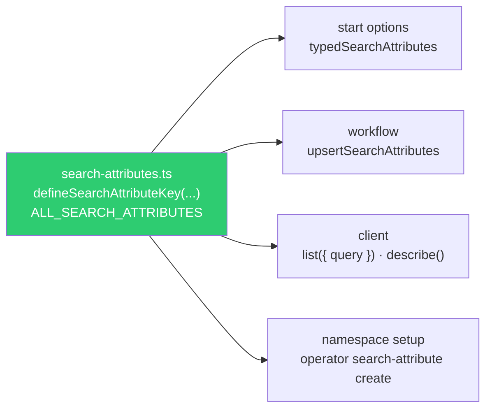

# Typed Search Attributes

> Declare every custom search attribute once with `defineSearchAttributeKey`, and write,
> upsert, read, and register it through that one key — never through a string.

## Problem

Search attributes are how workflows become findable: `TenantId = 'store-001' AND
EntityStatus = 'open'`. They are also the most stringly-typed thing in a Temporal
application. The untyped form — `searchAttributes: { TenantId: ['store-001'] }` — is
deprecated in the TypeScript SDK, and it fails the way string-keyed maps always fail:

- The name is typed in four places: the start options, an `upsertSearchAttributes` call,
  the client's list query, and the namespace-registration script. Misspell one and the
  result is not an error — it is an empty result set.
- The value type is invisible. `Keyword` vs `KeywordList` vs `Datetime` is decided at
  registration time; the untyped API happily lets you write a string to a datetime
  attribute, and the write is rejected at runtime.
- Adding an attribute means remembering to register it in every namespace (dev, staging,
  prod) — a start with an unregistered key fails.

## Solution

**One file declares every key; everything else imports it.**



### Rules

1. **Keys are constants with a type.** `defineSearchAttributeKey('TenantId',
   SearchAttributeType.KEYWORD)` fixes both the name and the value type; TypeScript then
   rejects `{ key: TenantId, value: 42 }`.

2. **Write through the key at start** — `typedSearchAttributes: SearchAttributePair[]` —
   via the same start-options builder that builds the workflow ID
   ([Structured Workflow IDs](../structured-workflow-ids/)).

3. **Change through the key mid-run** — `upsertSearchAttributes([{ key, value }])`, a
   workflow command (replay-safe, recorded). `value: null` clears.

4. **Read through the key** — `workflowInfo().typedSearchAttributes.get(Key)` inside a
   workflow, `(await handle.describe()).typedSearchAttributes.get(Key)` in a client, and
   `Key.name` when building a list query string.

5. **Register from the same list.** The `ALL_SEARCH_ATTRIBUTES` array drives the namespace
   setup script, so "declared but not registered" cannot happen.

## Example

```typescript file=search-attributes.ts
import { defineSearchAttributeKey, SearchAttributeType } from '@temporalio/common';

export const TenantId      = defineSearchAttributeKey('TenantId',      SearchAttributeType.KEYWORD);
export const Domain        = defineSearchAttributeKey('Domain',        SearchAttributeType.KEYWORD);
export const EntityStatus  = defineSearchAttributeKey('EntityStatus',  SearchAttributeType.KEYWORD);
export const CorrelationId = defineSearchAttributeKey('CorrelationId', SearchAttributeType.KEYWORD);
export const Tags          = defineSearchAttributeKey('Tags',          SearchAttributeType.KEYWORD_LIST);
export const TotalCents    = defineSearchAttributeKey('TotalCents',    SearchAttributeType.INT);
export const UpdatedAt     = defineSearchAttributeKey('UpdatedAt',     SearchAttributeType.DATETIME);

/** Rule 5: the registration script reads this; a key not listed here cannot be used. */
export const ALL_SEARCH_ATTRIBUTES = [TenantId, Domain, EntityStatus, CorrelationId, Tags, TotalCents, UpdatedAt];
```

```typescript file=contracts.ts
import type { SearchAttributePair } from '@temporalio/common';
import { CorrelationId, Domain, EntityStatus, TenantId } from './search-attributes';

export function buildStartSearchAttributes(p: { tenantId: string; domain: string; correlationId?: string }): SearchAttributePair[] {
  const pairs: SearchAttributePair[] = [
    { key: TenantId, value: p.tenantId },
    { key: Domain, value: p.domain },
    { key: EntityStatus, value: 'open' },
  ];
  if (p.correlationId) pairs.push({ key: CorrelationId, value: p.correlationId });
  return pairs;
}
```

```typescript file=workflows.ts
import { condition, defineSignal, setHandler, upsertSearchAttributes, workflowInfo } from '@temporalio/workflow';
import { EntityStatus, TenantId, TotalCents, UpdatedAt } from './search-attributes';

export const checkoutSignal = defineSignal<[number]>('cart.checkout');

export async function cartWorkflow(): Promise<void> {
  let checkedOutTotal: number | null = null;
  setHandler(checkoutSignal, (total) => { checkedOutTotal = total; });

  const tenantId = workflowInfo().typedSearchAttributes.get(TenantId);   // Rule 4: typed read
  if (tenantId === undefined) throw new Error('cartWorkflow started without TenantId');

  await condition(() => checkedOutTotal !== null);

  // Rule 3: a typed upsert on transition — recorded as a command, replay-safe.
  upsertSearchAttributes([
    { key: EntityStatus, value: 'checked_out' },
    { key: TotalCents, value: checkedOutTotal! },
    { key: UpdatedAt, value: new Date() },     // DATETIME takes a Date; sandbox Date is deterministic
  ]);
}
```

```typescript file=client.ts
import { Client } from '@temporalio/client';
import { EntityStatus, TenantId } from './search-attributes';

const client = new Client();

export async function listOpenCarts(tenantId: string): Promise<string[]> {
  const ids: string[] = [];
  // Rule 4: the query string is built from the key's name, not retyped.
  const query = `${TenantId.name} = '${tenantId}' AND ${EntityStatus.name} = 'open'`;
  for await (const wf of client.workflow.list({ query })) ids.push(wf.workflowId);
  return ids;
}

export async function statusOf(workflowId: string): Promise<string | undefined> {
  const desc = await client.workflow.getHandle(workflowId).describe();
  return desc.typedSearchAttributes.get(EntityStatus);
}
```

```typescript file=setup-search-attributes.ts
// Rule 5: registration is generated from the same list. Run once per namespace.
import { SearchAttributeType } from '@temporalio/common';
import { ALL_SEARCH_ATTRIBUTES } from './search-attributes';

const CLI_TYPE: Record<SearchAttributeType, string> = {
  TEXT: 'Text', KEYWORD: 'Keyword', INT: 'Int', DOUBLE: 'Double',
  BOOL: 'Bool', DATETIME: 'Datetime', KEYWORD_LIST: 'KeywordList',
};

for (const key of ALL_SEARCH_ATTRIBUTES) {
  console.log(`temporal operator search-attribute create --name ${key.name} --type ${CLI_TYPE[key.type]}`);
}
```

And the thing the types buy you, as a test the compiler runs:

```typescript file=types.test.ts
import type { SearchAttributePair } from '@temporalio/common';
import { TenantId, TotalCents } from './search-attributes';

const ok: SearchAttributePair[] = [{ key: TenantId, value: 'store-001' }, { key: TotalCents, value: 1999 }];

// @ts-expect-error — a KEYWORD key takes a string, not a number
const bad: SearchAttributePair = { key: TenantId, value: 42 };

export { ok, bad };
```

## Provenance

`defineSearchAttributeKey` / `typedSearchAttributes` are the SDK's typed API (the untyped
one is `@deprecated`). The single-file registry and the registration-from-the-same-list
rule are first-party, from a platform with three namespaces and a `CorrelationID` /
`CorrelationId` casing drift that made one environment's "everything for this order"
query silently return nothing. [Structured Workflow IDs](../structured-workflow-ids/) was
written against the same keys; this page is where they are declared.

## Gotchas

1. **Register before you write.** A start or upsert with an unregistered key fails. Run
   the setup script as part of namespace provisioning, and keep it idempotent (`create` on
   an existing attribute of the same type is a no-op; of a *different* type it is an error).

2. **Types are permanent.** A registered attribute's type cannot change. If `TotalCents`
   should have been `DOUBLE`, add `TotalAmount` and retire the old key — do not try to
   re-register.

3. **`DATETIME` is the one place `Date` is right.** The typed API takes and returns `Date`
   objects for `DATETIME` keys — an explicit exception to
   [Record-First DTOs](../record-first-dtos/), because the SDK converts them itself.
   Inside a workflow, `new Date()` is deterministic.

4. **Multi-valued means `KEYWORD_LIST`.** Writing a `string[]` to a `KEYWORD` key is a
   type error (good); registering `Tags` as `KEYWORD` and then wishing it were a list is a
   gotcha 2 situation.

5. **Upserts are commands.** Each `upsertSearchAttributes` adds to history. Batch the
   changes for one transition into a single call, and don't upsert on every signal in a
   hot loop.

6. **Visibility is eventually consistent.** A `list()` immediately after a start may not
   return the new workflow. Render from the workflow's own response, use visibility for
   lists — the same split as
   [Workflow-Mediated Projections](../workflow-mediated-projections/).

7. **Keys are namespace-global.** Two applications in one namespace share the attribute
   space; prefix by application if that is your topology. And mind the custom-attribute
   count limit per namespace — every key in `ALL_SEARCH_ATTRIBUTES` costs one.

## References

- [Temporal — Search attributes (custom)](https://docs.temporal.io/search-attribute#custom-search-attribute)
- [Temporal TypeScript SDK — Enriching the UI with search attributes](https://docs.temporal.io/develop/typescript/platform/enriching-ui)
- [`temporal operator search-attribute`](https://docs.temporal.io/cli/command-reference/operator#search-attribute)
- [Structured Workflow IDs](../structured-workflow-ids/) — the start-options builder that consumes these keys
- [Record-First DTOs](../record-first-dtos/) — and the `DATETIME` exception to it
- [Workflow-per-Entity vs. Singleton](../workflow-per-entity-vs-singleton/) — why entities need search attributes to be listable
