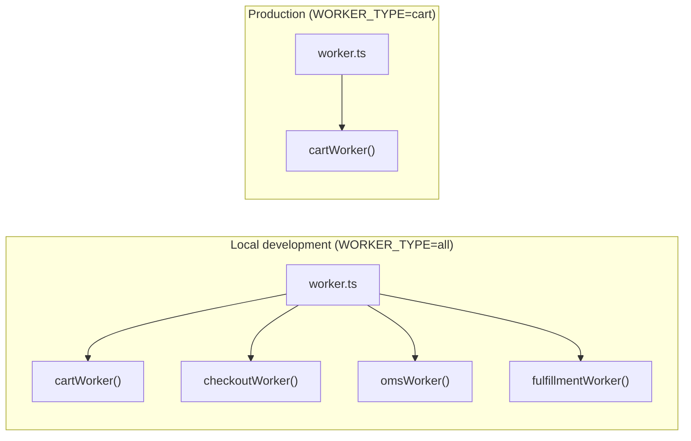

# Unified Worker Topology

> A single all-in-one worker process for local development that fans out to
> per-domain worker processes in staging and production — without changing the
> domain code.

## Problem

A Temporal application with multiple domains (cart, checkout, fulfillment, etc.) needs
one `Worker` per task queue. In production you want each worker in its own process — or
container, or Lambda function — for independent scaling, isolated failure, and
per-domain resource limits. But running six separate processes locally is a poor
developer experience: six terminal tabs, six restarts on code changes, six sets of
connection boilerplate, and no quick "start everything" command.

The naive fix — a monolithic worker that registers everything on one task queue —
destroys the isolation that per-domain queues provide. And maintaining two completely
separate entrypoints (one for dev, one for prod) means every new domain must be wired
into both, with the inevitable drift where one is updated and the other isn't.

## Solution

Factor each domain worker into a **module** that exports a start function, and compose
them in a **unified launcher** that reads a `WORKER_TYPE` environment variable to
decide what to start.



### The domain worker module

Each domain exports a function that accepts a shared `NativeConnection` and returns a
**created, not yet running** `Worker`:

```typescript
// cart/worker.ts
import { NativeConnection, Worker, WorkerOptions } from '@temporalio/worker';
import { activities } from './activities-impl';
import { CART_TASK_QUEUE } from '../contracts';

async function create(
  connection: NativeConnection,
  otelConfig: Pick<WorkerOptions, 'interceptors' | 'sinks'> = {},
): Promise<Worker> {
  return Worker.create({
    connection,
    workflowsPath: require.resolve('./workflows'),
    activities,
    taskQueue: CART_TASK_QUEUE,
    ...otelConfig,
  });
}

export default create;
```

Key design choices:

- **Accepts a connection, does not create one.** The launcher owns the single
  `NativeConnection`; domains share it. No per-domain connection management.
- **Accepts OTel config.** Interceptors and sinks are injected by the launcher,
  keeping observability wiring out of domain code.
- **Returns the `Worker`, not `worker.run()`.** The launcher decides when to run and —
  more importantly — owns shutdown. A module that calls `run()` itself hides the handle
  the launcher needs to stop it.

### The unified launcher

```typescript
// worker.ts — the single entrypoint for all environments
import { NativeConnection, Runtime, Worker } from '@temporalio/worker';

import cartWorker from './cart/worker';
import checkoutWorker from './checkout/worker';
import omsWorker from './oms/worker';
import fulfillmentWorker from './fulfillment/worker';

const TEMPORAL_ADDRESS = process.env.TEMPORAL_ADDRESS || 'localhost:7233';

Runtime.install({
  telemetryOptions: {
    metrics: { prometheus: { bindAddress: '0.0.0.0:9466' } },
  },
});

async function run() {
  const connection = await NativeConnection.connect({ address: TEMPORAL_ADDRESS });

  // All workers share the same connection
  const workers = await Promise.all([
    cartWorker(connection),
    checkoutWorker(connection),
    omsWorker(connection),
    fulfillmentWorker(connection),
  ]);

  // Promise.all is fail-fast: if any worker's run() rejects, the others are still
  // polling, but the process exits below — by design. A half-alive worker process
  // that serves three queues and silently ignores the fourth is worse than a restart.
  await Promise.all(workers.map((w) => w.run()));
}

run().catch((err) => {
  console.error('Worker process failed', err);
  process.exit(1);
});
```

### Selective startup via `WORKER_TYPE`

For production, the same entrypoint starts only the specified domain:

```typescript
async function run() {
  const workerType = (process.env.WORKER_TYPE || 'all').toLowerCase();
  const connection = await NativeConnection.connect({ address: TEMPORAL_ADDRESS });

  const factories: Record<string, () => Promise<Worker>> = {
    cart:         () => cartWorker(connection),
    checkout:     () => checkoutWorker(connection),
    oms:          () => omsWorker(connection),
    fulfillment:  () => fulfillmentWorker(connection),
  };

  let selected: Array<() => Promise<Worker>>;
  if (workerType === 'all') {
    selected = Object.values(factories);
  } else {
    const factory = factories[workerType];
    if (!factory) {
      throw new Error(
        `WORKER_TYPE="${workerType}" matched no workers. ` +
        `Expected "all" or one of: ${Object.keys(factories).join(', ')}`
      );
    }
    selected = [factory];
  }

  const workers = await Promise.all(selected.map((create) => create()));
  await Promise.all(workers.map((w) => w.run()));
}
```

### Graceful shutdown

This is the part that is genuinely harder with N workers in one process — and the SDK
does most of it, as long as you know where. `shutdownSignals` is a **`Runtime`** option
(default `SIGINT`, `SIGTERM`, `SIGQUIT`, `SIGUSR2`): the process-global runtime installs
one listener per signal and, when one fires, calls `shutdown()` on every worker
registered with it. So in the simplest case SIGTERM already stops all workers cleanly.

Take control anyway when you want one place to log *which* workers drained and which hit
`shutdownGraceTime`, or when a worker that fails to start must not leave the others
running headless:

```typescript
Runtime.install({
  shutdownSignals: [],                    // the launcher owns signal handling
  telemetryOptions: { metrics: { prometheus: { bindAddress: '0.0.0.0:9466' } } },
});

// ... inside run(), after creating the workers:
let stopping = false;
const stop = (signal: NodeJS.Signals) => {
  if (stopping) return;
  stopping = true;
  console.info(`${signal} received — shutting down ${workers.length} worker(s)`);
  for (const w of workers) w.shutdown();   // stops polling; in-flight tasks drain
};
process.once('SIGINT', stop);
process.once('SIGTERM', stop);

await Promise.all(workers.map((w) => w.run()));
console.info('all workers stopped');
```

`worker.run()` resolves once the worker has drained after `shutdown()`, so awaiting the
`Promise.all` is the "everything stopped" barrier — no process registry required at this
scale. Set `shutdownGraceTime` on each `Worker.create()` so a stuck activity cannot hold
the process forever. An application that also runs plugin workers or long-lived
subprocesses grows this into an explicit registry of stoppable things, but the shape is
the same.

### Scaling: the worker registry

For larger applications, extract the per-domain configuration into a declarative
**worker registry** — a data structure that each entrypoint reads:

```typescript
interface DomainWorkerSpec {
  domain: string;
  taskQueue: string;
  workflowsPath: string;
  activities: Record<string, unknown>;
}

const WORKER_REGISTRY: Record<string, DomainWorkerSpec> = {
  cart: {
    domain: 'cart',
    taskQueue: CART_TASK_QUEUE,
    workflowsPath: path.join(__dirname, 'cart', 'workflows.ts'),
    activities: cartActivities,
  },
  checkout: {
    domain: 'checkout',
    taskQueue: CHECKOUT_TASK_QUEUE,
    workflowsPath: path.join(__dirname, 'checkout', 'workflows.ts'),
    activities: checkoutActivities,
  },
  // ...
};
```

Both the long-lived launcher and (if applicable) a Lambda handler read from this
same registry. Adding a new domain means one entry — not two separate wiring jobs.

`workflowsPath` pointing at a `.ts` file works under `tsx`/`ts-node` in development. A
production image should pre-bundle each domain once with `bundleWorkflowCode()` and pass
`workflowBundle` instead — the registry entry carries the bundle path in that case.

## Example: deployment configurations

**Local development — one process, all domains:**

```yaml
# docker-compose.yml
services:
  workers:
    build: .
    command: npx tsx ./src/temporal/worker.ts
    environment:
      WORKER_TYPE: all
```

**Production — one deployment per domain** (shown as Kubernetes; the same applies to ECS
services, Lambda functions, or Swarm `deploy.replicas`):

```yaml
# k8s/cart-worker.yaml
apiVersion: apps/v1
kind: Deployment
metadata: { name: cart-worker }
spec:
  replicas: 2
  template:
    spec:
      containers:
        - name: worker
          image: app/workers:1.4.0
          command: ["node", "dist/temporal/worker.js"]
          env:
            - { name: WORKER_TYPE, value: cart }
```

The same image, the same entrypoint, different `WORKER_TYPE` values.

## Provenance

This is a first-party pattern developed across two applications: a multi-tenant
e-commerce platform (eight domain workers, monorepo with Turborepo, plugin workers for
third-party integrations) and a full-stack commerce demo (six domain workers, single
repo). The demo uses the simpler form — a flat `Promise.all()` of domain worker
imports. The platform evolved the pattern further into a declarative worker registry
with `WORKER_TYPE` branching, per-domain metrics bind addresses, plugin worker
lifecycle management, and a process registry for verifiable shutdown.

The pattern has two known prior-art influences:

1. **Microservice "fat binary" pattern.** A single binary that starts different services
   based on a command-line flag or environment variable, common in Go monorepo
   deployments.
2. **Django's `manage.py runserver`** and similar framework launchers that compose
   multiple subsystems into one dev process.

## Gotchas

1. **`Runtime.install()` is process-global.** Telemetry, logging, and the Rust Core
   runtime are configured once for the process. All workers in an `all` launch share
   the same Prometheus metrics endpoint. When several `WORKER_TYPE` processes share a
   host (or a dev machine), each needs its own metrics bind address
   (`WORKER_METRICS_BIND=0.0.0.0:9467`); one-per-container deployments can all use the
   same port.

2. **Connection retry with backoff.** On cold start (especially in Docker), the Temporal
   server's health check may pass before gRPC is fully ready. The launcher should retry
   `NativeConnection.connect()` with exponential backoff rather than crashing
   immediately.

3. **Workers do not hot-reload workflow code.** Whether running one domain or all, a
   code change in `workflows.ts` requires a worker restart — see
   [Worker Restart and Replay](../../gotchas/worker-restart-replay.md#workers-do-not-hot-reload-workflow-code).
   The all-in-one launcher makes this cheaper (one restart, not six), not unnecessary.

4. **`WORKER_TYPE=all` must reject in Lambda.** A serverless function is bound to
   exactly one task queue. Starting "all" workers in a Lambda produces a function that
   polls multiple queues, none of them correctly — validate and fail fast.

5. **Adding a new domain.** The registry (or the launcher's import list) is the only
   place a new domain is wired. If you forget it, the worker starts successfully but
   the new task queue is never polled — workflows start but are never picked up, with
   no error on either side. A test that asserts the registry keys match a canonical
   domain list catches this at build time.

## References

- [Two-File Activity](../two-file-activity/) — the sandbox-safe activity import each domain worker uses
- [Temporal TypeScript SDK — `Worker.shutdown()` / `shutdownGraceTime`](https://typescript.temporal.io/api/classes/worker.Worker#shutdown)
- [Worker-Specific Task Queues](https://docs.temporal.io/design-patterns/worker-configuration-patterns) — the official pattern for routing work to specialized workers
