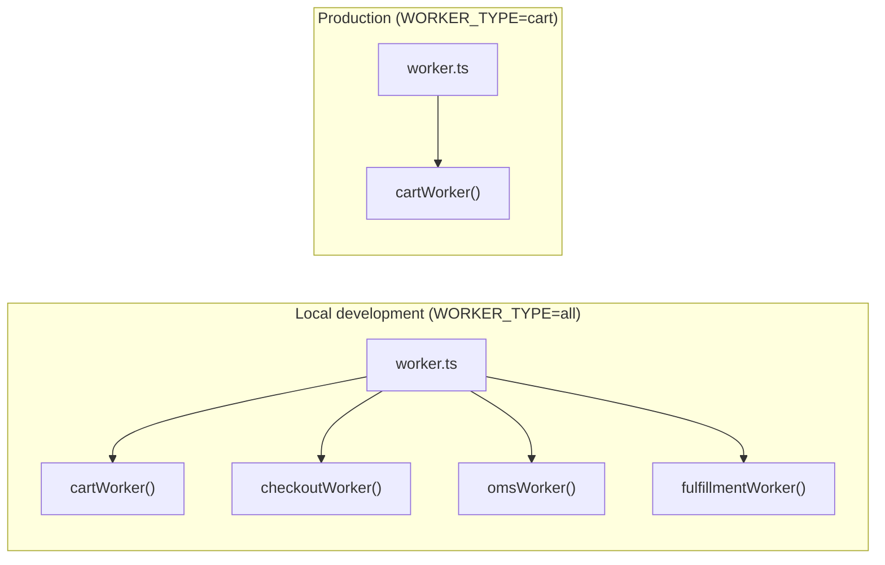

# Unified Worker Topology

> A single all-in-one worker process for local development that fans out to
> per-domain worker processes in staging and production — without changing the
> domain code.

## Problem

A Temporal application with multiple domains (cart, checkout, fulfillment, etc.) needs
one `Worker` per task queue. In production you want each worker in its own process — or
container, or Lambda function — for independent scaling, isolated failure, and
per-domain resource limits. But running six separate processes locally is a poor
developer experience: six terminal tabs, six restarts on code changes, six sets of
connection boilerplate, and no quick "start everything" command.

The naive fix — a monolithic worker that registers everything on one task queue —
destroys the isolation that per-domain queues provide. And maintaining two completely
separate entrypoints (one for dev, one for prod) means every new domain must be wired
into both, with the inevitable drift where one is updated and the other isn't.

## Solution

Factor each domain worker into a **module** that exports a start function, and compose
them in a **unified launcher** that reads a `WORKER_TYPE` environment variable to
decide what to start.



### The domain worker module

Each domain exports a function that accepts a shared `NativeConnection` and returns
a `Promise<void>` (resolves when the worker shuts down):

```typescript
// cart/worker.ts
import { NativeConnection, Worker, WorkerOptions } from '@temporalio/worker';
import * as activities from './activities-impl';
import { CART_TASK_QUEUE } from '../contracts';

async function start(
  connection: NativeConnection,
  otelConfig: Pick<WorkerOptions, 'interceptors' | 'sinks'> = {},
): Promise<void> {
  const worker = await Worker.create({
    connection,
    workflowsPath: require.resolve('./workflows'),
    activities,
    taskQueue: CART_TASK_QUEUE,
    ...otelConfig,
  });
  return worker.run();
}

export default start;
```

Key design choices:

- **Accepts a connection, does not create one.** The launcher owns the single
  `NativeConnection`; domains share it. No per-domain connection management.
- **Accepts OTel config.** Interceptors and sinks are injected by the launcher,
  keeping observability wiring out of domain code.
- **Returns a `Promise<void>`.** The launcher can `Promise.all()` them or start
  them selectively.

### The unified launcher

```typescript
// worker.ts — the single entrypoint for all environments
import { NativeConnection, Runtime } from '@temporalio/worker';

import cartWorker from './cart/worker';
import checkoutWorker from './checkout/worker';
import omsWorker from './oms/worker';
import fulfillmentWorker from './fulfillment/worker';

const TEMPORAL_ADDRESS = process.env.TEMPORAL_ADDRESS || 'localhost:7233';

Runtime.install({
  telemetryOptions: {
    metrics: { prometheus: { bindAddress: '0.0.0.0:9466' } },
  },
});

async function run() {
  const connection = await NativeConnection.connect({ address: TEMPORAL_ADDRESS });

  // All workers share the same connection
  await Promise.all([
    cartWorker(connection),
    checkoutWorker(connection),
    omsWorker(connection),
    fulfillmentWorker(connection),
  ]);
}

run().catch((err) => {
  console.error('Worker process failed', err);
  process.exit(1);
});
```

### Selective startup via `WORKER_TYPE`

For production, the same entrypoint starts only the specified domain:

```typescript
async function run() {
  const workerType = (process.env.WORKER_TYPE || 'all').toLowerCase();
  const connection = await NativeConnection.connect({ address: TEMPORAL_ADDRESS });

  const workers: Record<string, () => Promise<void>> = {
    cart:         () => cartWorker(connection),
    checkout:     () => checkoutWorker(connection),
    oms:          () => omsWorker(connection),
    fulfillment:  () => fulfillmentWorker(connection),
  };

  if (workerType === 'all') {
    await Promise.all(Object.values(workers).map((start) => start()));
  } else {
    const start = workers[workerType];
    if (!start) {
      throw new Error(
        `WORKER_TYPE="${workerType}" matched no workers. ` +
        `Expected "all" or one of: ${Object.keys(workers).join(', ')}`
      );
    }
    await start();
  }
}
```

### Scaling: the worker registry

For larger applications, extract the per-domain configuration into a declarative
**worker registry** — a data structure that each entrypoint reads:

```typescript
interface DomainWorkerSpec {
  domain: string;
  taskQueue: string;
  workflowsPath: string;
  activities: Record<string, unknown>;
}

const WORKER_REGISTRY: Record<string, DomainWorkerSpec> = {
  cart: {
    domain: 'cart',
    taskQueue: CART_TASK_QUEUE,
    workflowsPath: path.join(__dirname, 'cart', 'workflows.ts'),
    activities: cartActivities,
  },
  checkout: {
    domain: 'checkout',
    taskQueue: CHECKOUT_TASK_QUEUE,
    workflowsPath: path.join(__dirname, 'checkout', 'workflows.ts'),
    activities: checkoutActivities,
  },
  // ...
};
```

Both the long-lived launcher and (if applicable) a Lambda handler read from this
same registry. Adding a new domain means one entry — not two separate wiring jobs.

## Example: deployment configurations

```yaml
# docker-compose.yml — local development
services:
  workers:
    command: npx tsx ./src/temporal/worker.ts
    environment:
      WORKER_TYPE: all   # all domains in one process

---
# production — one container per domain
services:
  cart-worker:
    command: npx tsx ./src/temporal/worker.ts
    environment:
      WORKER_TYPE: cart
    deploy:
      replicas: 2

  checkout-worker:
    command: npx tsx ./src/temporal/worker.ts
    environment:
      WORKER_TYPE: checkout
    deploy:
      replicas: 1
```

The same image, the same entrypoint, different `WORKER_TYPE` values.

## Provenance

This is a first-party pattern. The need arises naturally in any multi-domain Temporal
application: the SDK examples show one worker per file, which works for a single domain
but doesn't scale to a project with multiple task queues.

The pattern has two known prior-art influences:

1. **Microservice "fat binary" pattern.** A single binary that starts different services
   based on a command-line flag or environment variable, common in Go monorepo
   deployments.
2. **Django's `manage.py runserver`** and similar framework launchers that compose
   multiple subsystems into one dev process.

## Gotchas

1. **`Runtime.install()` is process-global.** Telemetry, logging, and the Rust Core
   runtime are configured once for the process. All workers in an `all` launch share
   the same Prometheus metrics endpoint. In production, each `WORKER_TYPE` process needs
   its own metrics bind address (e.g., `WORKER_METRICS_BIND=0.0.0.0:9466`).

2. **Connection retry with backoff.** On cold start (especially in Docker), the Temporal
   server's health check may pass before gRPC is fully ready. The launcher should retry
   `NativeConnection.connect()` with exponential backoff rather than crashing
   immediately.

3. **Workers do not hot-reload workflow code.** Whether running one domain or all, a
   code change in `workflows.ts` requires a worker restart. This is a Temporal SDK
   limitation, not a consequence of the topology pattern.

4. **`WORKER_TYPE=all` must reject in Lambda.** A serverless function is bound to
   exactly one task queue. Starting "all" workers in a Lambda produces a function that
   polls multiple queues, none of them correctly — validate and fail fast.

5. **Adding a new domain.** The registry (or the launcher's import list) is the only
   place a new domain is wired. If you forget it, the worker starts successfully but
   the new task queue is never polled — workflows start but are never picked up, with
   no error on either side. A test that asserts the registry keys match a canonical
   domain list catches this at build time.

## References

- [Two-File Activity](../two-file-activity/) — the sandbox-safe activity import each domain worker uses
- [Worker-Specific Task Queues](https://docs.temporal.io/design-patterns/worker-configuration-patterns) — the official pattern for routing work to specialized workers
