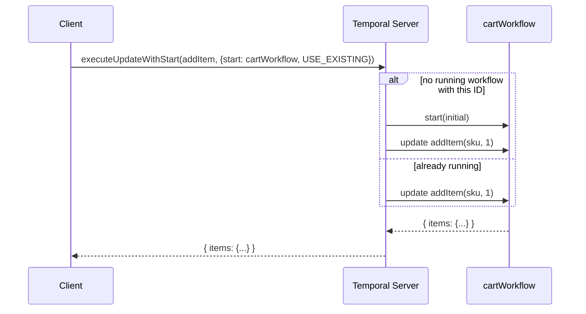

# `updateWithStart`

> Atomic lazy entity creation: if the workflow exists, route the update to it; if not,
> start the workflow and deliver the update — zero race conditions.

## Problem

Entity workflows are created on first touch. A shopper adds an item; if there is no cart
workflow for that cart ID yet, one must be started, and the item must be added, and the
caller wants the resulting cart back. The obvious client code is a read-then-write:

```typescript fragment
// ❌ Two requests for the same new cart race here
try {
  await client.workflow.getHandle(workflowId).describe();
} catch {
  await client.workflow.start(cartWorkflow, { workflowId, taskQueue, args: [initial] });
}
const cart = await client.workflow.getHandle(workflowId).executeUpdate(addItemUpdate, { args: [sku, 1] });
```

Two concurrent first-touches both see "no workflow", both call `start`, and one of them
gets `WorkflowExecutionAlreadyStartedError`. Catching that and retrying works but is three
round trips and a special case. `signalWithStart` collapses start-or-deliver into one
atomic call, but a signal has no return value — the web app still has to query afterwards,
and by then another request may have changed the cart.

## Solution

Use the SDK's **Update-with-Start**: one call that carries both a start operation and an
update. The server atomically either starts the workflow and delivers the update as its
first message, or — under `WorkflowIdConflictPolicy.USE_EXISTING` — delivers the update
to the already-running workflow. The caller gets the update's return value either way.



Pair it with [Structured Workflow IDs](../structured-workflow-ids/): because the ID is
derived from `(tenantId, domain, entityId)`, the client never needs a lookup to know
*which* workflow to start-or-update.

### Rules

1. **`workflowIdConflictPolicy` is mandatory and is the whole point.** `USE_EXISTING`
   gives lazy-create semantics. `FAIL` gives create-exactly-once (the update is not
   delivered if the workflow exists). Choose deliberately; the SDK will not default it.

2. **Register the update handler synchronously at the top of the workflow.** The update
   arrives in the first workflow task, before any activity has run. A handler registered
   after an `await` is too late for it.

3. **The start arguments are the entity's *initial* state, not this request's payload.**
   The request's payload goes in the update's `args`. If the workflow already existed, the
   start arguments are ignored — so they must never carry anything the caller needs applied.

4. **Give each request an `updateId` if the client may retry.** Retrying a
   `executeUpdateWithStart` with the same `updateId` is idempotent; without one, a retry
   after a network blip adds the item twice.

## Example

```typescript file=workflows.ts
import { condition, defineSignal, defineUpdate, setHandler } from '@temporalio/workflow';

export interface CartState {
  cartId: string;
  items: Record<string, number>;   // sku → quantity
}

export const addItemUpdate = defineUpdate<CartState, [string, number]>('addItem');
export const checkoutSignal = defineSignal('checkout');

export async function cartWorkflow(initial: CartState): Promise<CartState> {
  const cart: CartState = { ...initial, items: { ...initial.items } };
  let checkedOut = false;

  // Rule 2: handlers first, before any await.
  setHandler(
    addItemUpdate,
    (sku, qty) => {
      cart.items[sku] = (cart.items[sku] ?? 0) + qty;
      return cart;
    },
    { validator: (sku, qty) => { if (qty <= 0) throw new Error(`qty must be positive for ${sku}`); } },
  );
  setHandler(checkoutSignal, () => { checkedOut = true; });

  await condition(() => checkedOut);
  return cart;
}
```

```typescript file=client.ts
import { Client, WithStartWorkflowOperation } from '@temporalio/client';
import { WorkflowIdConflictPolicy } from '@temporalio/common';
import { addItemUpdate, cartWorkflow } from './workflows';
import type { CartState } from './workflows';
import { buildWorkflowId } from './contracts';

export async function addItem(
  client: Client,
  tenantId: string,
  cartId: string,
  sku: string,
  qty: number,
  requestId: string,          // from the HTTP request — makes client retries idempotent
): Promise<CartState> {
  const startWorkflowOperation = new WithStartWorkflowOperation(cartWorkflow, {
    workflowId: buildWorkflowId(tenantId, 'cart', cartId),
    taskQueue: 'cart-queue',
    args: [{ cartId, items: {} }],                                 // Rule 3: initial state only
    workflowIdConflictPolicy: WorkflowIdConflictPolicy.USE_EXISTING,  // Rule 1
  });

  return client.workflow.executeUpdateWithStart(addItemUpdate, {
    args: [sku, qty],
    updateId: requestId,                                           // Rule 4
    startWorkflowOperation,
  });
}
```

If the caller also needs the handle — to query later, or to learn the run ID —
`await startWorkflowOperation.workflowHandle()` returns it whether or not the update
succeeded.

## Provenance

Update-with-Start is a server and SDK feature; the official Workflow-Messaging patterns
describe it alongside Signal-with-Start. The first-party contribution is the **rule set
for lazy entities** — conflict policy as a deliberate choice, initial-state-only start
args, handler-first registration, request-scoped `updateId` — learned while replacing a
describe-then-start-then-update sequence in a storefront's add-to-cart path. The race
that motivated it showed up only under load testing, as a small steady rate of
`WorkflowExecutionAlreadyStartedError` from two browser tabs hitting the same new cart.

## Gotchas

1. **A closed workflow is not a conflict.** The conflict policy applies to a *running*
   workflow with that ID. If the cart workflow has completed (checked out) and a request
   arrives for the same cart ID, `USE_EXISTING` happily starts a brand-new, empty cart —
   subject to `workflowIdReusePolicy`. If a finished entity must stay finished, set
   `workflowIdReusePolicy: WorkflowIdReusePolicy.REJECT_DUPLICATE` in the start options,
   or mint a new entity ID for the next cart.

2. **Updates need a running worker.** Unlike a signal, an update is not just recorded — it
   waits for a worker to execute the handler. If no worker is polling the task queue, the
   call blocks until one appears or the client times out.

3. **Validator rejections are not failures of the start.** If the workflow had to be
   started and the validator rejects the update, the workflow is still running (with no
   items). That is usually fine for a cart; for entities where "created empty" is a
   problem, validate on the client first or use `FAIL` plus a separate start path.

4. **Older self-hosted servers may not support it.** Update-with-Start is newer than
   Signal-with-Start; on a server without it the call fails with an "unimplemented" or
   permission error. Check the server version and the update-related dynamic config
   (`frontend.enableUpdateWorkflowExecution`, `frontend.enableExecuteMultiOperation`).

5. **`startUpdateWithStart` only waits for `ACCEPTED`.** Use it when the caller wants to
   return quickly and fetch the result later via the update handle. For request/response
   paths — the add-to-cart case — `executeUpdateWithStart` is the right call.

## References

- [Temporal TypeScript SDK — Update-with-Start](https://docs.temporal.io/develop/typescript/workflows/message-passing#update-with-start)
- [Temporal Design Patterns — Workflow Messaging](https://docs.temporal.io/design-patterns/workflow-messaging-patterns) — the official Signal-with-Start / Request-Response via Updates patterns
- [Structured Workflow IDs](../structured-workflow-ids/) — the builder that makes the ID derivable
- [Signals, Updates & Queries](../signals-updates-queries/) — when an update is the right primitive
- [`allHandlersFinished`](../all-handlers-finished/) — why the handler must be registered first and finished last
