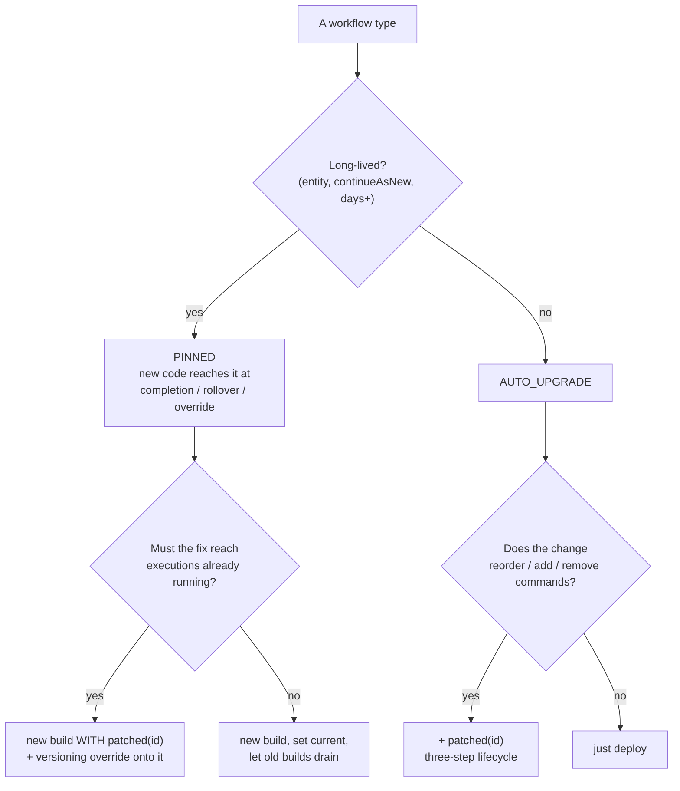

# Versioning Strategy

> Decide how every workflow change reaches in-flight executions: Worker Deployment
> Versioning with pinned entities by default, `patched()` for hotfixes and surgical
> changes — and the rules that keep the two from colliding.

## Problem

Every change to workflow code is a question about the executions already running: will
the new build replay their histories? Temporal offers two answers — **Worker Deployment
Versioning** (each execution is pinned to the build that started it, or auto-upgrades)
and **`patched()`** (one build, two code paths, chosen per history) — and presents them
side by side. Teams without a rule pick per incident, which produces two failure modes:

- **Freeze.** Nobody dares reorder an activity, so the workflow accretes "add it at the end"
  changes and `if (legacy)` branches that are really patches without the bookkeeping.
- **Patch forever.** Every change is a `patched('…')`; the IDs pile up; nobody runs the
  three-step removal; the workflow is a decade of branches, all live.

And a change that is safe under one mechanism is an outage under the other: reordering
commands in an `AUTO_UPGRADE` workflow without a patch is the canonical non-determinism
incident.

## Solution

Two mechanisms, one decision rule, and a small set of non-negotiables.

| | Worker Deployment Versioning — `PINNED` | `patched()` |
|---|---|---|
| Unit of versioning | a **build** (deployment name + build ID) | a **branch** inside one build |
| In-flight executions | keep running on the build that started them; new starts go to the *Current* version | run the new build; `patched(id)` is `false` on old histories, `true` on new |
| Code cost of a change | none — deploy, set current, drain | a named branch, kept until every old execution is gone |
| Operational cost | old builds keep running until they drain ("rainbow" deployment) | none beyond the three-step removal |
| Default for | **long-lived entities** — carts, services, anything with `continueAsNew` | **short-lived `AUTO_UPGRADE` workflows** that must change command order; hotfixes that must reach *running* executions; projects not yet on deployment versioning |
| Cannot do | move a *running* pinned execution to new code by itself | keep old builds alive — old code is gone the moment you deploy |



### Rules

1. **Behaviour is declared per workflow type, not inherited from the worker default.**
   `setWorkflowOptions({ versioningBehavior: VersioningBehavior.PINNED }, cartWorkflow)` next
   to the workflow. A worker-level default hides intent; entities are `PINNED`, short
   request/response workflows are `AUTO_UPGRADE`, and the file says which.

2. **Every deploy is a new build ID; the deployment name is the worker fleet.** Build ID =
   git SHA (or CI build number), never reused. Deployment name = one per
   `WORKER_TYPE` (`workers-cart`, `workers-checkout`) —
   [Unified Worker Topology](../unified-worker-topology/).

3. **Roll out in three CLI steps:** ramp → watch → current. Old versions keep their pinned
   executions until they drain; sunset a version only when `describe-version` shows none.

4. **Pinned stays pinned across `continueAsNew` — by default.** A rollover does *not*
   move an entity to the Current version. To upgrade at the rollover boundary, use the
   (experimental) upgrade-on-Continue-as-New: watch `workflowInfo().targetWorkerDeploymentVersionChanged`
   in the loop's wake condition and continue with `initialVersioningBehavior: 'AUTO_UPGRADE'`.
   Without it, pinned entities migrate when they complete — or when an operator overrides
   them.

5. **`patched()` is how a new build becomes history-compatible; the override is how
   executions move.** A hotfix that must reach running pinned executions is a new build
   *with* `patched()`, then `temporal workflow update-options --versioning-override-behavior …`
   to move them onto it. `patched()` alone changes nothing for pinned executions; an
   override alone onto an incompatible build is a non-determinism failure.

6. **Patch IDs are permanent names with a three-step lifecycle** — add (`patched`) →
   retire (`deprecatePatch`) → delete — and each step is gated by
   [replay tests](../../reference/replay-testing.md) against histories from before it.

7. **Never both in one change without saying why.** A diff that adds `patched()` to a
   pinned workflow should state the override it is preparing for; otherwise it is a
   branch that will never be removed.

## Example

```typescript file=worker.ts
import { NativeConnection, Worker } from '@temporalio/worker';
import { VersioningBehavior } from '@temporalio/common';
import { activities } from './activities-impl';

const buildId = process.env.BUILD_ID;                 // Rule 2: the git SHA, set by CI
if (!buildId) throw new Error('BUILD_ID is required to start a versioned worker');
const workerType = process.env.WORKER_TYPE ?? 'cart';

const connection = await NativeConnection.connect({ address: process.env.TEMPORAL_ADDRESS ?? 'localhost:7233' });
const worker = await Worker.create({
  connection,
  taskQueue: `${workerType}-queue`,
  workflowsPath: require.resolve('./workflows'),
  activities,
  workerDeploymentOptions: {
    useWorkerVersioning: true,
    version: { deploymentName: `workers-${workerType}`, buildId },
    defaultVersioningBehavior: VersioningBehavior.AUTO_UPGRADE,   // the *default*; entities override it (Rule 1)
  },
});
await worker.run();
```

```typescript file=workflows.ts
import {
  allHandlersFinished, condition, defineSignal, makeContinueAsNewFunc, setHandler,
  setWorkflowOptions, workflowInfo,
} from '@temporalio/workflow';
import { VersioningBehavior } from '@temporalio/common';

export interface CartState { cartId: string; items: Record<string, number> }
export const addItemSignal = defineSignal<[string, number]>('cart.addItem');
export const checkoutSignal = defineSignal('cart.checkout');

// Rule 4: rollover is the one place a pinned entity can move builds (experimental option).
const continueOnTargetVersion = makeContinueAsNewFunc<typeof cartWorkflow>({
  initialVersioningBehavior: 'AUTO_UPGRADE',
});

export async function cartWorkflow(state: CartState): Promise<CartState> {
  const cart: CartState = { ...state, items: { ...state.items } };
  let inputs = 0;
  let done = false;
  setHandler(addItemSignal, (sku, qty) => { cart.items[sku] = (cart.items[sku] ?? 0) + qty; inputs += 1; });
  setHandler(checkoutSignal, () => { done = true; });

  await condition(() =>
    done
    || inputs >= 500
    || workflowInfo().continueAsNewSuggested
    || workflowInfo().targetWorkerDeploymentVersionChanged,    // a newer Current version exists
  );
  await condition(allHandlersFinished);
  if (done) return cart;
  return continueOnTargetVersion(cart);
}
// Rule 1: the entity is PINNED — in-flight runs never see a new build mid-run.
setWorkflowOptions({ versioningBehavior: VersioningBehavior.PINNED }, cartWorkflow);

export async function sendReceiptWorkflow(orderId: string): Promise<void> {
  // seconds long, no state to protect — takes new code immediately
  void orderId;
}
setWorkflowOptions({ versioningBehavior: VersioningBehavior.AUTO_UPGRADE }, sendReceiptWorkflow);
```

The three-step `patched()` lifecycle for an `AUTO_UPGRADE` workflow that must reorder
two activities:

```typescript fragment
// Step 1 — ship the patch. Old histories take the else-branch; new executions the if-branch.
if (patched('ship-before-invoice')) {
  await ship(order); await invoice(order);
} else {
  await invoice(order); await ship(order);
}

// Step 2 — once replay tests show no history still needs the old branch, retire it.
deprecatePatch('ship-before-invoice');
await ship(order); await invoice(order);

// Step 3 — once no execution started before step 2 remains, delete the deprecatePatch line.
await ship(order); await invoice(order);
```

Rolling a build out, pinning, and moving executions:

```bash
# Ramp the new build to 10 %, watch, then make it Current (Rule 3)
temporal worker deployment set-ramping-version --deployment-name workers-cart --build-id "$BUILD_ID" --percentage 10
temporal worker deployment describe --name workers-cart
temporal worker deployment set-current-version --deployment-name workers-cart --build-id "$BUILD_ID"

# What version is this execution on, and is it pinned?
temporal workflow describe -w store-001.cart.c-42

# Hotfix path (Rule 5): move one pinned execution onto a build that carries the patched() fix
temporal workflow update-options -w store-001.cart.c-42 \
  --versioning-override-behavior pinned \
  --versioning-override-deployment-name workers-cart \
  --versioning-override-build-id "$BUILD_ID"
```

## Provenance

Both mechanisms are Temporal's; the official TypeScript versioning guide documents each,
and the Worker Deployments guide documents rollout, pinning, and the Continue-as-New
upgrade option. The decision rule and the "`patched()` makes a build compatible, the
override moves executions" framing are first-party — written after a platform that had
been on `patched()` alone for two years counted its live patch IDs (thirty-one), and
after its first attempt at deployment versioning assumed a `continueAsNew` would carry
entities to the new build (it did not; rule 4). The `setWorkflowOptions`-per-type rule
came from a worker whose `AUTO_UPGRADE` default quietly applied to a cart workflow.

## Gotchas

1. **Server and SDK support.** Worker Deployment Versioning needs a server with the
   feature enabled (current releases; check yours — it is enabled on the local dev server
   used to verify this page). The older `buildId` / `useVersioning` worker options are
   `@deprecated`; do not mix them with `workerDeploymentOptions`. Upgrade-on-Continue-as-New
   (`targetWorkerDeploymentVersionChanged`, `initialVersioningBehavior`) is marked
   experimental in SDK 1.22.

2. **`AUTO_UPGRADE` + reordering = the classic incident.** The new build picks up every
   running execution on its next workflow task; if the command sequence changed without a
   `patched()`, they all fail with non-determinism at once. Rule 6 is not optional for
   `AUTO_UPGRADE` types.

3. **Pinned executions need their build's workers alive.** Tasks for a pinned execution
   route only to workers of that version. If you stop the old build's workers before its
   executions drain, those executions stall — see the docs on recovering pinned workflows.
   Sunset a version after `describe-version` shows it has drained, not after the deploy.

4. **Children and `continueAsNew` runs follow the parent's behaviour by default.** A child
   of a pinned parent is pinned to the same version; a child of an auto-upgrade parent
   auto-upgrades. Check with `temporal workflow describe` before assuming.

5. **Activity implementations are not versioned by history.** Changing an activity's body
   is always safe for replay (results come from history). Changing its *name* or its
   position in the workflow is a command change — that is what the patch is for.

6. **Removing a patch too early is the same incident in slow motion.** Step 2 before all
   old-branch executions are gone fails them on their next task. Replay tests against a
   pre-step-2 history corpus are the gate; see [Replay Testing](../../reference/replay-testing.md).

7. **Overrides are per execution and persist.** An override set for a hotfix stays on that
   execution; clear it (`--versioning-override-behavior unspecified`) once the fleet is on
   the fixed build, or the execution keeps ignoring Current.

## References

- [Temporal — Worker Deployments](https://docs.temporal.io/production-deployment/worker-deployments)
- [Temporal — Worker Versioning](https://docs.temporal.io/production-deployment/worker-deployments/worker-versioning)
- [Temporal — Roll out and pin](https://docs.temporal.io/production-deployment/worker-deployments/worker-versioning/roll-out-and-pin)
- [Temporal — Upgrade on Continue-as-New](https://docs.temporal.io/production-deployment/worker-deployments/worker-versioning/upgrade-on-continue-as-new)
- [Temporal — Sunset and GC](https://docs.temporal.io/production-deployment/worker-deployments/worker-versioning/sunset-and-gc)
- [Temporal — Recover pinned Workflows](https://docs.temporal.io/production-deployment/worker-deployments/recover-pinned-workflows)
- [Temporal TypeScript SDK — Versioning: patching](https://docs.temporal.io/develop/typescript/workflows/versioning#patching), [deprecated patches](https://docs.temporal.io/develop/typescript/workflows/versioning#deprecated-patches), [worker versioning](https://docs.temporal.io/develop/typescript/workflows/versioning#worker-versioning), [workflow cutovers](https://docs.temporal.io/develop/typescript/workflows/versioning#workflow-cutovers)
- [`temporal worker deployment`](https://docs.temporal.io/cli/command-reference/worker)
- [Replay Testing](../../reference/replay-testing.md) — the gate for every step above
- [`continueAsNew`](../continue-as-new/) — the rollover boundary rule 4 is about
- [Worker Restart and Replay](../../gotchas/worker-restart-replay.md) — what a non-determinism failure is
- [Unified Worker Topology](../unified-worker-topology/) — one deployment name per `WORKER_TYPE`
