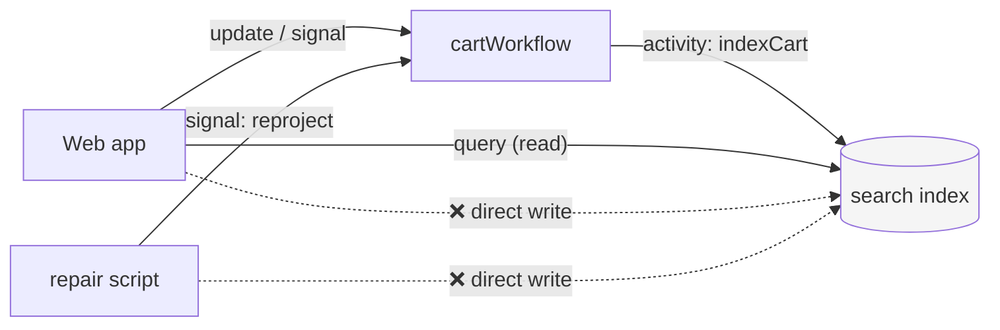

# Workflow-Mediated Projections

> Route all Elasticsearch projection writes through workflow activities, never from
> web app code or standalone scripts — ensuring projection consistency and making
> every write auditable in the workflow event history.

## Problem

A CQRS read model — a search index of carts, orders, shipments — has one hard question:
*who is allowed to write it?* The moment the answer is "whoever has the client" the model
decays:

- A web request handler writes the document directly after calling the workflow, "so the
  UI is fresh". Now two writers race for the same document, and the request handler's
  version — built from what it *sent*, not what the workflow *accepted* — wins often enough
  to be noticed only in production.
- A one-off "fix-up script" writes documents from a database dump. The workflows keep
  running from their own state, the index now disagrees with them, and nothing will
  reconcile it.
- Nobody can answer "why does this document say X?" because the write is not recorded
  anywhere a human can read.

## Solution

**The entity workflow is the only writer of its entity's document**, and it writes only
through activities.



### Rules

1. **One writer per document.** The workflow that owns the entity (by
   [structured ID](../structured-workflow-ids/)) owns its projection. No other code writes
   that document.

2. **Writes are activities.** Every write is a scheduled, retried, recorded activity —
   visible in the workflow's history with its input payload. "Why does the document say
   X?" becomes "open the workflow, find the `indexCart` activity".

3. **Reads are free.** Anyone may read the index: list pages, search, dashboards.

4. **Repair is a message, not a write.** To fix a stale document, signal the workflow
   (`reproject`) and let it write. To rebuild an index, signal every workflow (or run a
   rebuild workflow that does), then swap the alias.

5. **Return authoritative state from the update, and read the index for lists.** The
   update response is read-your-writes; the index is eventually consistent. Design the UI
   around that split and the "make the UI fresh" temptation disappears.

### Enforcement

Two layers, from [Enforcement Mechanisms](../../reference/enforcement-mechanisms.md):

```javascript
// eslint.config.js — only activity implementations may import the search client
{
  files: ['src/**/*.ts'],
  ignores: ['src/**/activities-impl.ts'],
  rules: {
    'no-restricted-imports': ['error', {
      paths: [{ name: '@elastic/elasticsearch', message: 'Projection writes happen in activities-impl.ts only.' }],
    }],
  },
}
```

```typescript file=search-client.ts
import { Context } from '@temporalio/activity';

/** The one place the search client is constructed; refuses to write outside an activity. */
export function assertInActivity(op: string): void {
  try {
    Context.current();
  } catch {
    throw new Error(`${op}: projection writes are only allowed inside a Temporal activity`);
  }
}
```

## Example

```typescript file=activities.ts
import type { CartDocument } from './document';
export interface CartActivities {
  indexCart(doc: CartDocument): Promise<void>;
  markCartClosed(cartId: string, closedAt: string): Promise<void>;
}
```

```typescript file=activities-impl.ts
import { Client } from '@elastic/elasticsearch';
import type { CartActivities } from './activities';
import { assertInActivity } from './search-client';

const es = new Client({ node: 'http://localhost:9200' });
const INDEX = 'carts';            // an alias — see gotcha 3

export const activities = {
  async indexCart(doc) {
    assertInActivity('indexCart');
    await es.index({ index: INDEX, id: doc.cartId, document: doc });
  },
  async markCartClosed(cartId, closedAt) {
    assertInActivity('markCartClosed');
    await es.update({ index: INDEX, id: cartId, doc: { status: 'closed', closedAt } });
  },
} satisfies CartActivities;
```

```typescript file=document.ts
export interface CartDocument {
  cartId: string;
  status: 'open' | 'closed';
  itemCount: number;
  updatedAt: string;
}
```

```typescript file=workflows.ts
import { condition, defineSignal, defineUpdate, proxyActivities, setHandler } from '@temporalio/workflow';
import type { CartActivities } from './activities';
import type { CartDocument } from './document';

const { indexCart, markCartClosed } = proxyActivities<CartActivities>({ startToCloseTimeout: '10s' });

export interface CartState { cartId: string; items: Record<string, number>; updatedAt: string }
export const addItemUpdate = defineUpdate<CartState, [string, number]>('cart.addItem');
export const reprojectSignal = defineSignal('cart.reproject');    // Rule 4: repair is a message
export const checkoutSignal = defineSignal('cart.checkout');

function toDocument(s: CartState): CartDocument {
  return { cartId: s.cartId, status: 'open', itemCount: Object.values(s.items).reduce((n, q) => n + q, 0), updatedAt: s.updatedAt };
}

export async function cartWorkflow(input: CartState): Promise<CartState> {
  const state: CartState = { ...input, items: { ...input.items } };
  let dirty = true;
  let done = false;

  setHandler(addItemUpdate, (sku, qty) => {
    state.items[sku] = (state.items[sku] ?? 0) + qty;
    state.updatedAt = new Date().toISOString();
    dirty = true;
    return state;                                   // Rule 5: authoritative, read-your-writes
  });
  setHandler(reprojectSignal, () => { dirty = true; });
  setHandler(checkoutSignal, () => { done = true; });

  while (!done) {
    await condition(() => dirty || done);
    if (dirty) { dirty = false; await indexCart(toDocument(state)); }   // Rule 2: an activity
  }
  await markCartClosed(state.cartId, new Date().toISOString());
  return state;
}
```

And the web app, which reads the index and writes only through the workflow:

```typescript file=actions.ts
import { Client } from '@temporalio/client';
import { addItemUpdate } from './workflows';
import type { CartState } from './workflows';
import { searchCarts } from './search-read';        // read-only ES access — lives outside activities-impl

const client = new Client();

export async function addItem(workflowId: string, sku: string, qty: number): Promise<CartState> {
  return client.workflow.getHandle(workflowId).executeUpdate(addItemUpdate, { args: [sku, qty] });
}

export async function listOpenCarts(tenantId: string) {
  return searchCarts({ tenantId, status: 'open' });  // eventually consistent, by design
}
```

## Provenance

"Single writer" is old advice from CQRS/event-sourcing practice; its Temporal-specific
form — *the writer is the entity workflow, and the write is an activity* — is first-party,
arrived at after a storefront shipped exactly the two anti-patterns above (a request
handler that wrote the cart document "for freshness", and a repair script that wrote from
a database export). Both were replaced by a `reproject` signal, and the index has agreed
with the workflows since. The activity-context guard came from the same incident: it made
the next direct write a loud failure in development instead of a quiet one in production.

## Gotchas

1. **Eventual consistency is the contract.** The list page may lag the update by the
   projection latency. Do not "fix" this with a direct write; fix it by rendering the
   update response and, if a list must reflect a change instantly, by optimistic UI.

2. **Deleting vs. closing.** Prefer a terminal write (`status: 'closed'`) to a delete —
   closed entities are still searchable, and a rebuild does not have to reason about
   tombstones.

3. **Write through an alias.** Index mapping changes mean a new physical index
   (`carts-v2`); workflows write to the alias `carts`, a rebuild reprojects into `carts-v2`,
   then the alias flips. No workflow code changes.

4. **Rebuilds are fan-out.** A signal to every live entity workflow is the simplest
   rebuild; for millions of entities use a batch workflow (see the official Batch
   Processing patterns) that pages through workflow IDs and signals in bounded parallelism.

5. **Activities are at-least-once.** A worker crash after the index write but before the
   completion is recorded re-runs the activity. Index by document ID — idempotent — and it
   does not matter.

6. **Coalesce.** One write per mutation is correct but wasteful; combine with
   [Dirty-Flag Projection](../dirty-flag-projection/) as the example does.

## References

- [Dirty-Flag Projection](../dirty-flag-projection/) — coalescing the writes this pattern routes
- [Document Builder](../document-builder/) — building the document the activity writes
- [Two-File Activity](../two-file-activity/) — where the search client may live
- [Enforcement Mechanisms](../../reference/enforcement-mechanisms.md) — the lint rule and runtime guard above
- [Temporal Design Patterns — Batch Processing](https://docs.temporal.io/design-patterns/batch-processing-patterns) — for rebuilds at scale
