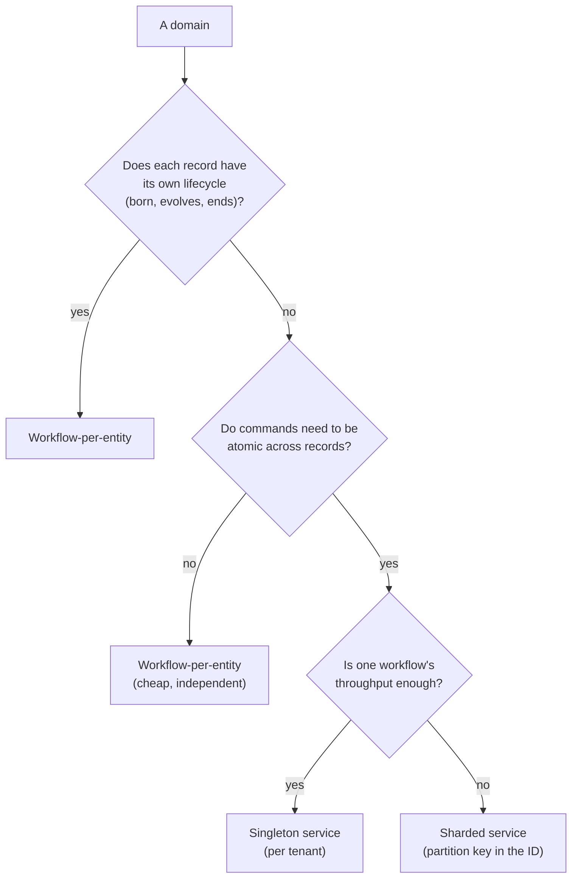

# Workflow-per-Entity vs. Singleton Service

> Choose the right cardinality model: workflow-per-entity for low-cardinality
> independent lifecycles, singleton services for high-cardinality shared
> infrastructure, sharded services when natural partitions exist.

## Problem

"One workflow per *what*?" is the first design decision in a Temporal application and the
most expensive one to change. Both extremes fail in characteristic ways:

- **Everything is an entity.** A workflow per cart, per order, per SKU, per stock level.
  Carts and orders are fine — each has a lifecycle and its commands touch one entity. SKUs
  are not: "reserve three SKUs for this order, all or nothing" now spans three workflows
  with no atomicity, and a catalog of a million SKUs is a million workflows that each
  receive a handful of commands a year.
- **Everything is a service.** One `cartService` workflow handling every cart's commands.
  A workflow processes one workflow task at a time, so every shopper queues behind every
  other shopper; history grows by every command in the tenant, so it rolls over
  constantly; and the whole tenant's carts share one hot partition.

## Solution

Three models, chosen per domain by asking what the *unit of consistency* is.

| Model | Workflow ID | Unit of consistency | Parallelism | History growth | Use for |
|---|---|---|---|---|---|
| **Workflow-per-entity** | `{tenant}.cart.{cartId}` | one entity | one workflow per entity — horizontal | per entity, slow | things with a lifecycle: cart, checkout, order, fulfillment |
| **Singleton service** | `{tenant}.inventory.service` | the whole tenant's data for that domain | one workflow — serialized | every command in the tenant | many small records with cross-record invariants and no lifecycle of their own: stock levels, sequence counters, rate limits |
| **Sharded service** | `{tenant}.inventory.shard-07` | one shard | one workflow per shard | per shard | a singleton whose throughput is exceeded, when commands partition naturally (by SKU hash, warehouse, region) |



### Rules

1. **Lifecycle ⇒ entity.** If you can say when it starts and when it ends, it is a
   workflow-per-entity. The workflow's completion *is* the end of the lifecycle.

2. **Cross-record atomicity ⇒ service.** If a command must succeed or fail across several
   records together, those records live in one workflow's state. The workflow serializes
   commands; that serialization is the consistency guarantee.

3. **Services are per tenant and per domain.** `{tenant}.inventory.service`, never a
   global god-workflow. Tenant isolation and blast radius both depend on it.

4. **Shard by a key that commands already carry.** A reservation names its SKUs; hash the
   SKU. If a command would need to touch two shards, the sharding key is wrong.

5. **Services roll over aggressively and keep state small.** A singleton's serialized
   state is a payload; it must fit the payload limit and serialize on every
   `continueAsNew`. Large catalogs mean sharding, or keeping the bulk in a store with the
   workflow as the serializing coordinator.

6. **Name it in the ID.** `service` and `shard-NN` are reserved entity IDs — see
   [Structured Workflow IDs](../structured-workflow-ids/) — so the model a workflow
   follows is readable from its ID in the UI.

## Example

The ID builder makes the three models explicit:

```typescript file=ids.ts
import { buildWorkflowId } from './contracts';

export const cartWorkflowId = (tenantId: string, cartId: string) =>
  buildWorkflowId(tenantId, 'cart', cartId);                 // per-entity

export const inventoryServiceId = (tenantId: string) =>
  buildWorkflowId(tenantId, 'inventory', 'service');         // singleton per tenant

export const INVENTORY_SHARDS = 16;
export function inventoryShardId(tenantId: string, sku: string): string {
  let h = 0;
  for (const ch of sku) h = (h * 31 + ch.charCodeAt(0)) >>> 0;
  return buildWorkflowId(tenantId, 'inventory', `shard-${String(h % INVENTORY_SHARDS).padStart(2, '0')}`);
}
```

A singleton inventory service: one workflow, commands serialized, cross-SKU reservations
atomic by construction.

```typescript file=inventory.ts
import { allHandlersFinished, condition, continueAsNew, defineUpdate, setHandler, workflowInfo } from '@temporalio/workflow';

export interface InventoryState {
  tenantId: string;
  levels: Record<string, number>;                   // sku → available
}
export interface Reservation { sku: string; qty: number }
export type ReserveResult = { ok: true } | { ok: false; short: Reservation[] };

export const reserveUpdate = defineUpdate<ReserveResult, [Reservation[]]>('inventory.reserve');
export const restockUpdate = defineUpdate<number, [string, number]>('inventory.restock');

export async function inventoryServiceWorkflow(input: InventoryState): Promise<never> {
  const state: InventoryState = { ...input, levels: { ...input.levels } };
  let inputs = 0;

  // All-or-nothing across SKUs — possible only because one workflow owns all of them.
  setHandler(reserveUpdate, (lines) => {
    inputs += 1;
    const short = lines.filter((l) => (state.levels[l.sku] ?? 0) < l.qty);
    if (short.length > 0) return { ok: false, short };
    for (const l of lines) state.levels[l.sku] -= l.qty;
    return { ok: true };
  });
  setHandler(restockUpdate, (sku, qty) => {
    inputs += 1;
    state.levels[sku] = (state.levels[sku] ?? 0) + qty;
    return state.levels[sku];
  });

  // Rule 5: a service never completes; it rolls over, often.
  await condition(() => inputs >= 200 || workflowInfo().continueAsNewSuggested);
  await condition(allHandlersFinished);
  return continueAsNew<typeof inventoryServiceWorkflow>(state);
}
```

Routing a reservation to the right shard, when the singleton is not enough:

```typescript fragment
// Every line in one reservation must hash to the same shard (Rule 4) — so the
// reservation API is per-shard, and a multi-shard order is a saga across shards.
const shardId = inventoryShardId(tenantId, lines[0].sku);
await client.workflow.getHandle(shardId).executeUpdate(reserveUpdate, { args: [lines] });
```

## Provenance

The entity model is the official Entity Workflow pattern. The three-way split and the
"unit of consistency" test are first-party, from a commerce platform where cart, checkout,
order, and fulfillment were entities from day one and inventory was the hard case: a
workflow-per-SKU first draft could not reserve an order atomically, and a single inventory
workflow could — at a throughput that was fine for one store and would not be for a
hundred. The answer was a singleton *per tenant* (each store's inventory is its own
workflow), with sharding documented as the next step and the shard number reserved in the
ID convention before it was needed.

## Gotchas

1. **A singleton's throughput is one workflow task at a time.** Measure it. Tens to low
   hundreds of updates per second is a realistic ceiling; if the domain needs more, shard
   before launch — changing the sharding scheme later is a data migration.

2. **Services must be started by someone.** Use [`updateWithStart`](../update-with-start/)
   with `USE_EXISTING` for lazy creation, so the first command creates the service and
   every later one finds it.

3. **Service state must fit a payload.** The whole `levels` record is serialized on every
   rollover and returned by every query. Past a few thousand keys, shard or externalize.

4. **Entities are cheap, but not free to *list*.** A million cart workflows are fine for
   the server; "show me all open carts" is a visibility query — set search attributes at
   start, and page.

5. **Don't let a service accrete.** "While we're in inventory, let's also track
   suppliers" is how a singleton becomes the god-workflow. One domain per service.

6. **Re-sharding is a migration.** Pick the shard count generously, bake it into the ID,
   and treat changing it as a planned cut-over with a drain-and-reproject step.

## References

- [Temporal Design Patterns — Entity Workflow](https://docs.temporal.io/design-patterns/entity-workflow)
- [Temporal TypeScript SDK — Entity pattern](https://docs.temporal.io/develop/typescript/best-practices/entity-pattern)
- [Structured Workflow IDs](../structured-workflow-ids/) — reserved slugs for services and shards
- [`updateWithStart`](../update-with-start/) — lazy creation of entities and services alike
- [`continueAsNew`](../continue-as-new/) — the service's heartbeat
- [State Machine Driver](../state-machine-driver/) — the loop most entities run
