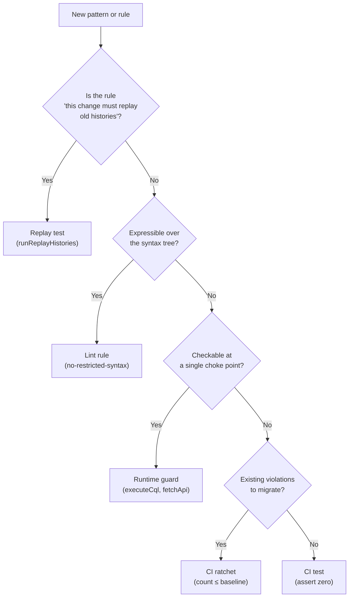

# Enforcement Mechanisms

> How to make patterns stick: lint rules, runtime guards, replay tests, and CI ratchets.

An architecture pattern that lives only in documentation will be violated by the first
contributor — human or AI agent — who never read it. The patterns in this catalog are
designed to be **enforced**, not just documented. This reference describes four
enforcement mechanisms, in order of preference.

---

## 1. Static Lint Rules

**Best for:** anything expressible over the syntax tree — forbidden imports, banned APIs,
banned string shapes.

ESLint's `no-restricted-imports` and `no-restricted-syntax` rules with AST selectors
cover a surprising amount of architectural enforcement:

### Banning direct SDK imports

Force all Temporal client usage through a single wrapper module:

```javascript
// eslint.config.js
{
  rules: {
    'no-restricted-imports': ['error', {
      paths: [{
        name: '@temporalio/client',
        message: 'Import from @/lib/temporal-client instead.',
      }],
    }],
  },
}
```

### Banning inline workflow IDs

Target the places an ID is *assigned*, not every template literal in the codebase:

```javascript
{
  files: ['src/**/client/**/*.ts', 'src/**/workflows.ts', 'src/**/workflows/**/*.ts'],
  rules: {
    'no-restricted-syntax': ['error', {
      selector: ':matches(VariableDeclarator[id.name=/[wW]orkflowId$/], Property[key.name="workflowId"]) > TemplateLiteral',
      message: 'Build workflow IDs with buildWorkflowId(), never inline.',
    }],
  },
}
```

### Banning clock reads in decision functions

Cover both declaration shapes — `function decide()` and `const decide = () =>`:

```javascript
{
  rules: {
    'no-restricted-syntax': ['error',
      {
        selector: ':matches(FunctionDeclaration[id.name="decide"], VariableDeclarator[id.name="decide"] > :function) :matches(CallExpression[callee.object.name="Date"], NewExpression[callee.name="Date"])',
        message: 'decide() must be pure — no Date calls. Inject timestamps via prepare().',
      },
    ],
  },
}
```

### Banning async predicates in `condition()`

```javascript
{
  rules: {
    'no-restricted-syntax': ['error', {
      selector: 'CallExpression[callee.property.name="condition"] > :matches(ArrowFunctionExpression, FunctionExpression)[async=true]',
      message: 'condition() predicates must be synchronous. Remove async. See gotchas/async-predicate-death-loop.md.',
    }],
  },
}
```

**Strength:** fires at the exact moment of the mistake, in the developer's feedback
loop, with remediation text attached. AI agents get the message in their error output.

**Limitation:** can only see the syntax tree, not runtime behavior. A query string built
dynamically cannot be linted for required clauses.

---

## 2. Runtime Guards

**Best for:** rules that depend on runtime values — query shapes, tenant isolation,
data-access patterns.

A runtime guard runs inside a shared choke point (a database wrapper, an HTTP client, a
projection writer) and validates every call at execution time.

### Example: Tenant isolation guard

The instance below is Cassandra-specific (the tenant column is `store_id`); the shape —
one wrapper every query goes through, one check inside it — is the pattern. Every query
touching tenant data must include the tenant column in the `WHERE` clause. A lint rule
cannot see a dynamically-built query string, but a guard inside the shared `executeCql`
wrapper can:

```typescript
function executeCql(query: string, params: unknown[]): Promise<ResultSet> {
  if (TENANT_QUERY_GUARD !== 'off') {
    const normalized = query.toLowerCase();
    if (!normalized.includes('store_id') && !isSystemTable(query)) {
      const msg = `Missing store_id in query: ${query.substring(0, 100)}`;
      if (TENANT_QUERY_GUARD === 'throw') throw new Error(msg);
      else logger.warn(msg);
    }
  }
  return client.execute(query, params);
}
```

**Strength:** catches patterns that static analysis cannot see. The guard runs on every
query, not just the ones a developer remembers to check.

**Limitation:** only catches violations at runtime — a code path that isn't exercised
in development won't be checked.

### Configuration pattern

Use an environment variable to control guard severity:

| Value | Behavior | Use in |
|---|---|---|
| `off` | Disabled | Production (if needed for performance) |
| `warn` | Log a warning | Staging, initial rollout |
| `throw` | Throw an error | Local development, CI |

---

## 3. Replay Tests

**Best for:** the one rule no lint or guard can check — that a change to workflow code is
still compatible with every execution already in flight.

This is Temporal's own enforcement mechanism and the catalog's patterns lean on it
constantly: every rule about determinism, every `patched()` branch, every "safe evolution"
claim in [Worker Restart and Replay](../gotchas/worker-restart-replay.md) is *testable*.
Export histories from a real environment, replay them against the candidate build, and
fail CI on a `DeterminismViolationError`.

```typescript
// replay.test.ts
import { readdir, readFile } from 'node:fs/promises';
import path from 'node:path';
import { Worker } from '@temporalio/worker';

it('replays recorded histories without non-determinism', async () => {
  const dir = path.join(__dirname, 'histories');          // exported JSON, committed
  const files = (await readdir(dir)).filter((f) => f.endsWith('.json'));
  expect(files.length).toBeGreaterThan(0);                // an empty corpus is a silent pass

  const histories = await Promise.all(
    files.map(async (f) => ({
      workflowId: f.replace(/\.json$/, ''),
      history: JSON.parse(await readFile(path.join(dir, f), 'utf8')),
    })),
  );

  for await (const result of Worker.runReplayHistories(
    { workflowsPath: require.resolve('../src/workflows') },
    histories,
  )) {
    if (result.error) {
      throw new Error(`${result.workflowId}/${result.runId}: ${result.error.message}`);
    }
  }
});
```

Refresh the corpus with the CLI — `temporal workflow show --workflow-id <id> --output json
> histories/<id>.json` — one history per distinct code path (each state, each `patched()`
branch, at least one `continueAsNew`). The full recipe — corpus curation, a coverage
assertion against the state registry, reading a failure, CI wiring — is in
[Replay Testing](replay-testing.md).

**Strength:** checks the property that actually breaks production, against real data, with
no mocks.

**Limitation:** only as good as the corpus. A path with no recorded history is not checked;
keep a test that asserts the corpus covers every state in the registry.

---

## 4. CI Ratchets

**Best for:** rules you cannot retrofit in one pass — existing violations need a gradual
migration path.

A ratchet records the current violation count and fails the build if the count
increases. Existing violations are tolerated (documented), but new ones are blocked.

### Example: `ALLOW FILTERING` ratchet

(Cassandra again — substitute whatever your store's "accidentally a full scan" construct
is.) `ALLOW FILTERING` changes a query's cost class from result-set-proportional to
table-proportional. Banning it outright would require rewriting existing queries; a
ratchet prevents new ones:

```typescript
// cassandra-conventions.test.ts
describe('ALLOW FILTERING ratchet', () => {
  it('should not introduce new ALLOW FILTERING queries', () => {
    const files = glob.sync('src/**/*.ts');
    const count = files.reduce((n, file) => {
      const content = readFileSync(file, 'utf8');
      return n + (content.match(/ALLOW FILTERING/gi) || []).length;
    }, 0);

    // Ratchet: current count is 0. If you need to increase it,
    // update this number and add a comment explaining why.
    expect(count).toBeLessThanOrEqual(0);
  });
});
```

### Example: Secondary index ratchet

```typescript
it('should not add new secondary indexes beyond the baseline', () => {
  const schema = readFileSync('infra/cassandra/schema.cql', 'utf8');
  const indexCount = (schema.match(/CREATE INDEX/gi) || []).length;
  expect(indexCount).toBeLessThanOrEqual(KNOWN_INDEX_BASELINE);
});
```

**Strength:** allows gradual migration without blocking all development. The ratchet
value is a documented, auditable decision.

**Limitation:** existing violations are tolerated — the ratchet only prevents growth.

---

## Choosing the Right Mechanism



## The Hierarchy

1. **Lint rules** are best because they fire at write time, in the developer's editor.
2. **Runtime guards** are next because they catch what lint cannot see.
3. **Replay tests** are the only check for determinism across a change; they run in CI
   but against real histories, which is why they rank above ratchets.
4. **CI ratchets** are last resort — they catch violations only at push time, and they
   tolerate existing violations.

All four are better than documentation alone. A pattern without enforcement is a
suggestion.
